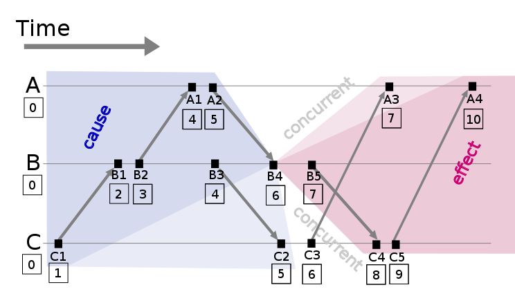
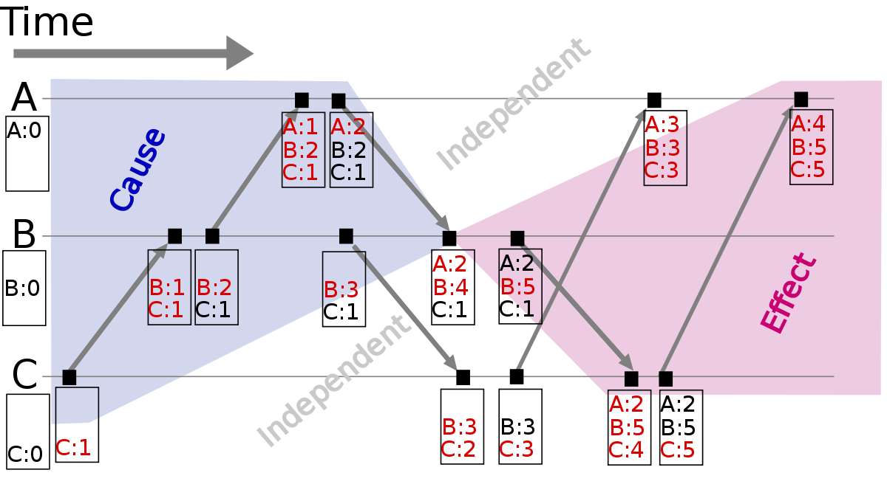
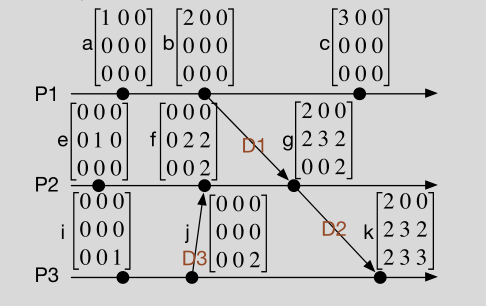
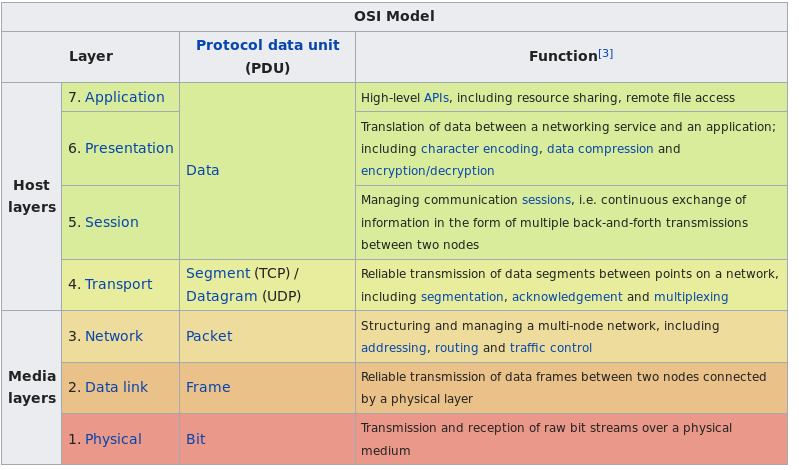

# Introduction
- **Def**: A distributed system is a collection of independent computers that appears to its users as a single coherent system. In which hardware and software components located at network computers communicate and coordinate their actions using only messages.
- In distributed systems the computer power is distributed.
- The parallel systems are able to do calculations in parallel.
- In parallel computing, all processors may have access to a shared memory to exchange information between processors.
- In distributed computing, each processor has its own private memory (distributed memory). Information is exchanged by passing messages between the processors.

## Types of memory
- **Shared memory**: 
    - From a strictly hardware point of view, describes a computer architecture where all processors have direct (usually bus based) access to common physical memory
    - can be used in parallel systems. In a programming sense, it describes a model where parallel tasks all have the same "picture" of memory and can directly address and access the same logical memory locations regardless of where the physical memory actually exists. 
- **Distributed memory**: 
    - In hardware, refers to network based memory access for physical memory that is not common.
    - As a programming model, tasks can only logically "see" local machine memory 
- **Distributed shared memory**: it is possible to access to other physical memory using an Ethernet bus for example
- Distributed system cannot be in the same hardware

## Characteristics
- **Concurrency**: is focus on cyberphysical systems. Concurrency is a property of a system representing the fact that multiple activities are executed at the same time. Only executing two different tasks simultaneously yields true parallelism.
- Shared resources (memory, bus)
- No global clock: no time stamp, it is an issue
- Independent failure; some parts may fail due to power consumption
- Heterogeneity: different types of devices working together. Need some type of virtualization
- Openness: Be able to interact with services from other open systems, irrespective of the underlying environment. 
- Scalability: a system is considered scalable if it is capable of increasing its total output under an increased load when resources (typically hardware) are added 

## Distributed System Categories
- Distributed computer system: 
    - Cluster and Grid computer systems for example
    - High-speed network (for security reasons) is not connect to Master node. 
    - High performance computation
- Distributed Information systems:
    - Client-Server applications. Transaction Processing Systems for example
    - Not only one type of network
    - Paradigm: not try to implement high performance computation in this form, information systems are meant to work with databases or to produce information.
    - A computer information system is a system composed of people and computers that processes or interprets information. The term is also sometimes used in more restricted senses to refer to only the software used to run a computerized database or to refer to only a computer system.
- Distributed Pervasive systems:
    - Electronic Health Care Systems for example
    - Store and process information
    - Small nodes, mobile, usually embedded, battery-powered
    - No calculation is done in the device, all are done in an external device
    - computing is made to appear anytime and everywhere. 

## Advantages
- Efficiency: more processing for less effort
- Concurrency: some computation can be done in parallel
- Reliability: "backup device"
- Scalability: easily extended

## Disadvantages
- Complexity:
    - Concurrency is sometimes hard to achieve
    - Reliability needs to be implemented
    - Scalability
- Security
- Manageability: 
    - The key to high availability is redundancy: if you have more than one of everything, you’re not susceptible to any single points of failure
    - Manageability includes both the ability to detect faults (or the absence of faults) and the ability to automatically react to the

# Architecture
- Architecture usually serves some purpose
    - Ensure that the structure will meet present and likely future demands
    - Reliable
    - Manageable: manage resources, logistics
    - Adaptable
    - Cost-Effective
- Architectural elements in developing distributed embedded systems
    - Communication entities: clusters, micro controllers, memory for examples
    - Communication paradigms: MPI
    - Roles and responsibilities: several clients will access the back-end. Roles implies access restrictions
    - Placement: distribute tasks, data. Virtualization
- Should be stable

## Viewpoints
- Different diagrams to capture structure and behavior (UML)
- Different roles have different viewpoints on systems

## Kruchten's 4+1
- Logical view: 
    - End-user functionality
    - relation between classes. 
    - Consider extend software
- Process view:
    - communication between objects. 
    - Help with planning communication overload (threads, tasks and their interdependencies)
- Physical view: 
    - System engineer viewpoint
    - Describes the mapping from software to hardware
    - Structural Information: Processing units, memories, networks, data, communication
- Development view:
    - Software engineer viewpoint 
    - Describes the organization of software
    - Modules and dependencies 
- Use case View:
    - End users and developers view
    - Describes user focused scenarios 

---
# General Challenges and Solutions
## Why parallelism
- Physical limits of frequency scaling already met years ago
- Advantages:
    - meet efficiency / performance demands / requirements
    - Better resource utilization, innovation and advancement
- Disadvantages: 
    - More complex design
    - Overheads: context switches, resource consumption (local mem, os resources for management)

## Concurrency - Parallelism
- **Process**: program instance
- **Task** is a specific part of a program. Has its own memory space.
- **Thread**: is the smallest sequence of programmed instructions that can be managed independently by a scheduler. has a virtual address space. runs in a single core. A thread is part of a Process, many threads can share memory.
- **Runnable**: interface of a task
-  An application may process one task at at time (sequentially) or work on multiple tasks at the same time (concurrently). Sub-tasks can be calculated in parallel.

### Concurrency Models:
- Useful [link](http://tutorials.jenkov.com/java-concurrency/concurrency-models.html)
- Delegator:
    - Incoming jobs are assigned to different workers. Each worker completes the full job. 
    - Workers share states, complex and non-deterministic: shared states can be modified by other threads in the system
- Reactive Systems:
    - The system's workers react to events occurring in the system, either received from the outside world or emitted by other workers
    - Event driven system
    - No shared state between workers: they can be implemented without having to think about all the concurrency problems that may arise from concurrent access to shared state.
    - Deterministic
    - Hard to debug
- Functional Parallelism:
    - The basic idea of functional parallelism is that you implement your program using function calls. All parameters passed to the function are copied, so no entity outside the receiving function can manipulate the data.
    - Similar to atomic operation

## Problems
- Parallel and Distributed systems:
    - Race conditions, visibility
    - Deadlocks: program get stuck no more executions
    - livelocks: program get stuck but keep executing instructions
    - spinlock: stuck in a loop, `while(1)` for example
    - priority inversion: high priority task is indirectly preempted by a lower priority
- Coordination solutions for mutual exclusion
    - Semaphores
    - OS services, monitors
    - Mutex algorithms for critical sections
    - Synchronization

## Race conditions
- If result of multiple threads executing a critical section depends on the sequence in which the threads execute the critical section, then the program contains a race condition 
- Critical section:  It cannot be executed by more than one process.  the critical section accesses a shared resources.
- **Solution**: Synchronized block or atomic operations
- Atomic operation: is the one that  appears to the rest of the system to occur instantaneously. Atomicity is a guarantee of isolation from interrupts, signals, concurrent processes and threads.

## Visibility
- Two threads have a copy of a value in memory and then they modify each copy, but they return the new value there are inconsistencies.

```c
/*No real code, just pseudo-code*/
i = 0;

// Call threads
// Thread 1:
    i++;

// Thread 2
    i += 2;

// What's the value of i?
// 3?, 2? ,1?
```

- **Solution** Use `volatile` keyword

## Java Conventions
- Synchronized: only one thread access to variable
- Volatile: immediate memory storage change at all accessing threads; prevent caching, no atomic
- Atomic: no interrupts
- Persistent data structures preserve previous version of themselves (immutability); operation always yields a new update structure and keeps previous structure

- Why not always use `sync` or `volatile`?
    - Too strict, inefficient, no compiler optimization possible
    - Trade-off between parallelism potential, performance, 
    - careful design, prone to bugs, development overhead;

## Mutex (Mutual exclusion)
- It is the requirement that one thread of execution never enter its critical section at the same time that another concurrent thread of execution enters its own critical section
- Software:
    - owner concept for unlocking and locking
    - may provide deletion safety and inversion safety 
    - Semaphores
- Hardware
    - Cache coherency protocols
    - disabling interrupts, context switching

### Lamport's Bakery algorithm
- Similar to when you draw a number and wait for your turn.
- People = threads with ID (used for priority in case of equal numbers)
- Used as mutex implementation for memory that lacks in synchronization primitives; does not rely on lower level atomic operations
- Pseudocode [link](https://en.wikipedia.org/wiki/Lamport%27s_bakery_algorithm#Pseudocode)

```c
// declaration and initial values of global variables

Entering: array [1..NUM_THREADS] of bool = {false};
Number: array [1..NUM_THREADS] of integer = {0};

lock(integer i) {
      Entering[i] = true;
        // get next ticket
      Number[i] = 1 + max(Number[1], ..., Number[NUM_THREADS]);
        // it is not my turn
      Entering[i] = false;

      for (integer j = 1; j <= NUM_THREADS; j++) {
          // Wait until thread j receives its number:
          while (Entering[j]) { /* nothing */ }

          // Wait until all threads with smaller numbers or with the same
          // number, but with higher priority, finish their work:
          while ( (Number[j] != 0) && ((Number[j], j) < (Number[i], i)))
                 { /* nothing */ }
      }
  }

unlock(integer i) {
      Number[i] = 0;
}


Thread(integer i) {
      while (true) {
          lock(i);
          // The critical section goes here...
          unlock(i);
          // non-critical section...
      }
}
```

### Semaphore
- Lamport's algorithms wastes clocks cycles (`while` waitings)
- `sync` primitives can be used by the OS
- Semaphore should use _atomic_ operations
- There is a counter that keeps track of how many resources are available.
- Can be seen as a counter that organized the resources.
- Two operations: incrementor `.v()` or `.release()` and decrementor `.p()` or `.acquire()`
- In the decrementor the `counter-=1`
    - If `counter >= 0` the access to CS is granted
    - If `counter < 0` the process is put to sleep and without completing the decrementor for the moment.
- In the incrementor the `counter+=1` given the opportunity to other processes to access the CS
- **Starvation**: If a thread disproportionately or never receives CPU time 
„starves (to death)“
- **Fairness**: With a queue (FIFO), the access to a resource can be schedule
- Example: Producer-Consumer Problem 
    - There is N slots
    - Producer: creates a resource an put it on a slot, if the all slots are full then, the producer stops producing until  there is a slot
    - Comsumer: uses a resource in a slot, if all the slots are empty then the consumer stops comsuming resources until there is a resource.

```c
#define N 100/*number of slots in the buffer*/
typedef int semaphore;/*semaphores are a special kind of int*/
semaphore mutex = 1;/*controls access to critical region*/
semaphore empty = N;/*counts empty buffer slots*/
semaphore full = 0;/*counts full buffer slots*/

// Incrementor -> P or acquire
// Decrementor -> V or release
// in this example to enter to CS, counter > 0
/*
Semaphores that are initialized to 1 and used by two or more processes
to ensure that only one of them can enter its critical region at the 
same time are called binary semaphores. 
*/
void producer(void)
{
    int item;
    while (TRUE) {/*TRUE is the constant 1*/
        item = produce_item( );/*generate something to put in buffer*/
        decrementor(&empty);/*decrement empty count*/
        decrementor(&mutex);/*enter critical region*/
        insert_item(item);/*put new item in buffer*/
        incrementor(&mutex);/*leave critical region*/
        incrementor(&full);/*increment count of full slots*/
    }
}

void consumer(void)
{
    int item;
    while (TRUE) {/*infinite loop*/
        decrementor(&full);/*decrement full count*/
        decrementor(&mutex);/*enter critical region*/
        item = remove_item( );/*take item from buffer*/
        incrementor(&mutex);/*leave critical region*/
        incrementor(&empty);/*increment count of empty slots*/
        consume_item(item);/*do something with the item*/
    }
}
```

### Monitor 
- Mutex + Condition variable/Partial synchronization
- Locks are not necessary if the buffer is empty
- Partial synchronization
- Semaphores can be used to implement monitors
- Monitors are reentrant: if a thread holds the lock of a CS and calls a synchronized method on the same object again, the lock does not need to be acquired again
- Multiple threads can be access the monitor, and the monitor manage the resources for the threads

```java
// One queue for the conditions
public class Monitor{
    private Semaphore mutex;
    Monitor(){
        mutex = new Semaphore(1);
    }
    public void enter(){
        mutex.p(); // decrementor
    }
    
    public void leave(){
        mutex.v(); // incrementor
    }
}

public synchronized void action(){
    /* threads waiting to 
        meet the condition variable   */
    while (!B) wait(); 
    
    // notify monitor data
    notifyAll();
}
```

## Deadlock
- Resource hierarchy
    - assign forks id
    - inefficient when requesting more than 2 resources 
- Arbitrator
    - New central entity manages the fork request
    - Reduced parallelism 
- Chandy/ Mirsa 
    - Philosopher's talk
```c
// Philosophers talk
while(1){
    think();
    takeForks();
    eat();
    putForks();
}
```

### Coffman condition
- A deadlock situation on a resource can arise if and only if all of the following conditions hold simultaneously in a system

- Mutual exclusion: The resources involved must be unshareable; otherwise, the processes would not be prevented from using the resource when necessary. Only one process can use the resource at any given instant of time.
- Hold and wait or resource holding: A process holding resources can request more resources 
- No preemption: a resource can be released only voluntarily by the process holding it.
- Circular wait:  The processes in the system form a circular list or chain where each process in the list is waiting for a resource held by the next process in the list. In general, there is a set of waiting processes, P = {P1, P2, …, PN}, such that P1 is waiting for a resource held by P2, P2 is waiting for a resource held by P3 and so on until PN is waiting for a resource held by P1.

### Deadlock handling
- Ignore: assuming there is no deadlock
- Detect: monitoring resources allocation and process states, and correct them if detected.
- Prevent: coffman conditions.
- Avoid: determine request that result in safe states. Banker's algorithm
- Livelocks

### Deadlock prevention
- Non-blocking or lock-free algorithm
- Use atomic read-modify-write primitives. For example, an atomic call can be done in the following way:
    - Change mem iff it did not change since last read otherwise repeat with new value

---
# Resource management protocols 
## Priority inversion
- Resource locking prevents high priority tasks to access the resource. So a high priority task is indirectly preempted by a lower priority task effectively "inverting" the relative priorities of the two tasks.
- Priority inversion: critical section access is not in priority order
- Solution:
    - disabling interruption
    - priority ceiling: CS manager has highest priority
    - priority inheritance: preemption prevention via temporarily high priority assignment for CS release
    - random boosting: ready tasks holding locks are randomly boosted in priority until they exit the critical section
- Deletion safety: process holding a Mutex cannot be accidentally deleted, this also prevents deadlocks
    

## Protocols
- Non Preemption Protocol - NPP: any task that locks a resource receive the highest priority of among all the task
- Highest Lower Protocol - HLP: any task that locks a resource receive the highest priority of among all the running tasks
- Priority Inheritance Protocol - PIP: assign the highest priority only another task wants to use the resource 
- Priority Ceiling Protocol - PCP: Enter to CS only if it is free and there is no chained block risk ( a HP task is waiting for a resource locked by a lower priority task that is waiting for a resource locked by even a lower priority task)

### Multiprocessor
- Remote blocking: A resource is locked by a task on a different processor
- Needs an extension of the protocols (more info slides)

# Time and clocks
- Use to causally order events (cause & effect)
- Ensure temporal correctness
- Determine deadlines and temporal coherences
- Embedded system development: debugging, profiling and trace
- Synchronization 
- Coordination
- Event serialization
- Causality: 
    - $a \mapsto b$ means that _b is causally effect by a_, also implies that _a happened before b_
    - $a \succ b$ means that _a happened before b_ (temporal order)

## Ordering mechanism
- Central observer: (monitor)
    - Are simple architectures
    - Slow down the system, and non-functional behavior
- Descentralized synchronization
    - Logical clocks
        - provide causally order
    - Real/ physical clocks
        - provide temporal order
        - Differ in resolution, accuracy and drift
        - it is possible to calculate elapsed time, current time

## Timestamps
- can be compared to each other with respect to their temporal precedence, if and only if they were derived from the same global clock or a set of synchronized clocks.
- need information about what clock is used, resolution, clock drift
- **clock drifting**: Clock drift refers to several related phenomena where a clock does not run at exactly the same rate as a reference clock. That is, after some time the clock "drifts apart" or gradually desynchronizes from the other clock. 

## Physical clocks
- Physical clock is a device which is based on some periodic physical oscillation (e.g. pendulum, quartz crystal, atom) in order to measure the progression of time. 
- Have desviations from the ideal clock 
- Granularity: duration between two consecutive ticks
- Clock measure $\Delta t_g = n_g/f$, $n_g$ is the numbers of ticks 
- Drift: $d = \frac{n_g}{f.\Delta t_g}$, ideally 1
- Deviation: $\delta = \|1-d\|$

### Clock synchronization 
- Two clocks hardly ever run synchronously
- Drift: rate deviation (per tick)
- Skew: deviation at specific point in time
- Apply adjustments continuously (e.g. Linux: POSIX, adjtime an system calls)

### Christian's algorithm
- synchronize with other machine
- Client gets data from a time server (e.g. access to radio clock)
- Computation of round trip time to compensate delay while adjusting own clock:
- With T0 = request sent time ant T1 = receive time; assuming network delays symmetric $T_new = T_server+(T1-T0)/2$

## Berkeley algorithm 
- Assumption: no machine has an accurate time source
- There is a master clock 
- Having multiple computers in a network, drift tendencies can be minimized by calculating average
- _outlayer_ clocks are not considered in the estimation

## Network time protocols
- Use Stratums to clasify clocks. 
    - Stratum 0: high precision clocks/ reference clocks
    - Stratum 16: unsynchronized
- Intended for multiple up- & downstream servers
- dispersion, jitter, clock filter calculation
- protocol definitions for declaring falsetickers

## Simple network protocol
- No mitigation algorithms / peer process operations / clock filter algorithm (compared with NTP)
- same protocol but time synchronization quality lower
- recommended to use only at highest stratums 
- intended for primary servers with single reference clock; no upstream servers

## Precision time protocol
- master slave architecture: ordinary clock and boundary 
- To transfer clock to another LAN
- low jitter, low latency

## Logical clocks
- give us information about which event happens before, after or in concurrency.



- Lamport's clock: every Process P keeps scalar counter C, increments it at each event, sends it with each send event
- Vector clock:  B4 and C2 are concurrent $B4 \| B2$ since $4 \geq 3$ and $1 \leq 2$
 


## Matrix clock
- Idea: keeping local state (LC), global state (VC) and each node’s view of the state (MC) a n x n matrix (n= number of nodes)
- "I know that you know about me and the others"



### Amazon DynamoDB 
Check slides - not that important

## CAP theorem
- tells you on what to focus your system
-  It is impossible to guarantee consistency, availability, and partition tolerance at once for a distributed data store
- Availability: all messages are served
- Consistency: all nodes see the same data at all times
- Partition-tolerance: system keeps working even if nodes or messages are lost

## Summary on logical clocks
- Cons: 
    - implementation overhead does not suit to DPS when there are constrains such as minimal resources, computation and communication
    - can not be used to determine physically quantifiable time values (e.g. latencies, deadlines, …)
    - problematic in dynamic systems where processes come and leave
- Pros:
    - use case: banking or booking systems: time between two events is not important, but the casual correct order is!
    - in distributed systems, synchronization with logical clocks created significant less overhead

- Logical clock:  “happened before” => smaller clock value
- Vector clock:  smaller clock value, determination of concurrency
- Matrix clock: keep track of other process’ view (which events occurred)

---
# Network interprocess communications 
## Network topologies
- Bus interconnect: cheap, reliable, easy extendable, does not support many participants , support master-slave topology
- Ring interconnect: Huge delay, privacy (all packages are known by all participants)
- Mesh interconnect: more options to communicate (many neighbors), high load is the mesh is large (use of clusters)
- Crossbar interconnect:  manage which participants will be connected (delay), and once they are connected the transmition is fast. 

## OSI model


## Interprocess communications 
- Synchronous: same as in sequence diagram in UML, send a message and waits for the answer
- Asynchronous: send a message and keep doing other tasks
- Indirect communication: do not wait for the suscriber, there is also an intermediary or Event Service (sync decoupling)
- Time decoupling: The sender and the receiver(s) can have independent lifetimes
- Space coupling: Communication direct towards a given receiver(s)
- Space decoupling: The sender does not know or need to know the identity of the receiver(s), and vice versa

## Shared memory communication
- Common resources on platform: FIFO, lpthreads, Sockets, shared memory, etc
- Example: shared memory - `shmget()`, `shmat()`

## Distributed shared memory communication
- Message passing (not memory addresses)
    - Share nothing approach
    - Robust
    - Asynchronous communication
- MPI:
    - supports direct (with memory addresses) and indirect (messages) communication.
    - blocking and non-blocking communication 
- Communications:
    - Generic:
        - Blocking: Sender blocks until message is in transit or delivered
        - Non-blocking: Returns immediately, additional commands to check status
    - Synchronous
        - Blocking: Sender and receiver synchronize, returns when message has been delivered
        - Non-blocking: Synchronization possible using additional commands
    - Buffered:
        - Blocking: Creates a sending buffer; returns, when message has been successfully copied
        - Non-blocking: Waiting is possible using additional commands
    - Ready:
        - Blocking: Similar to Generic; indicates that the receiver is ready to receive (optimization)
        - Non-blocking: Similar to Generic; guarantees that the receiver is ready to receive (optimization)


