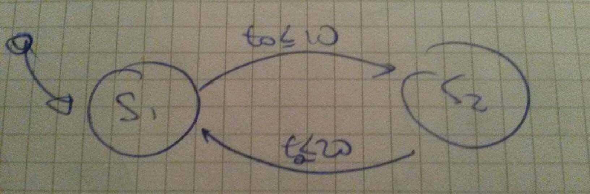
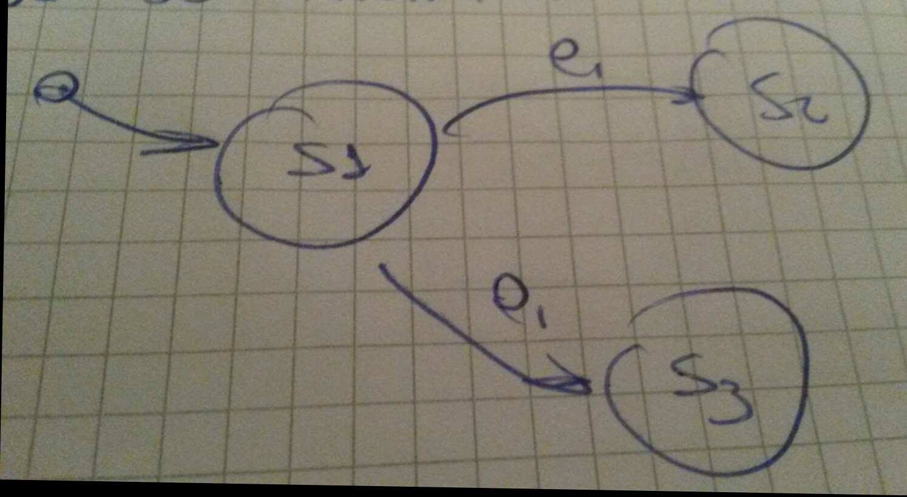
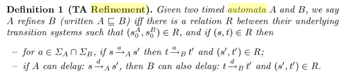
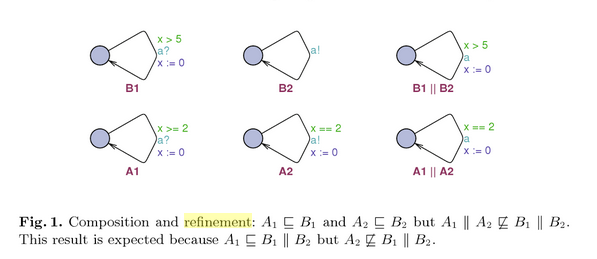
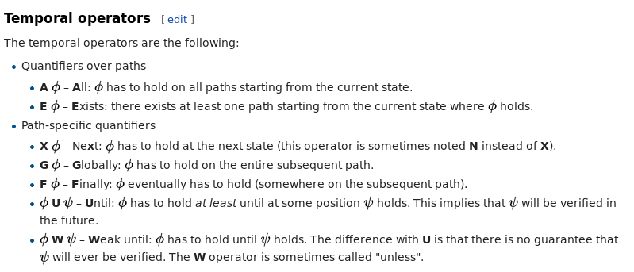

# Introduction
- **Embedded software engineering** is a multidisciplinary approach for developing solutions to complex engineering problems. 
- Embedded systems are often safety-critical applications where correct operation is vital to ensure the safety of the public and environment. 
- Typically have communications with people and other systems
- is the main driver for the industries
- **Embedded systems**: software embedded into a technical system which interacts with the world on a specific hardware. Interaction with the technical system via actors and sensors.
- **software-intensive systems** (balance HW and SW): is any system where software contributes essential influences to the design, construction, deployment, and evolution of the system as a whole.
- **software engineering**: The application of a systematic, disciplined, quantifiable approach to the development, operation, and maintenance of software; that is, the application of engineering to software. 
- System engineering integrates and use software engineering
- **Control engineering**: is the engineering discipline that focuses on the mathematical modeling systems of a diverse nature, analyzing their dynamic behavior, and using control theory to make a controller that will cause the systems to behave in a desired manner.
- Control engineering uses extensively computer software and hardware due to its strong mathematical foundations
- Other relevant disciplines:
    - Mechatronics: is the synergistic combination of mechanical, electronic and software engineering
    - Telematics: is the integrate use of telecommunications and informatics

## System characteristics
- Reactive systems: continuously sensing and reacting to the environment
- Real-time systems: The response should be delivered in a specific time. Executing in an specific time again and again
    - Deadline: the latest time until which the response to a stimulus is required.
    - Synchronous/periodic task: Can be used to address required activities with a period p. 
    - Asynchronous/aperiodic task: Can be used to address required activities for stimulus without knowledge about the occurrence.
    - Not only the correct behavior is important, but also its timely provision.
- Hard and soft Real-time systems:
    - The utility describes the time-dependent value of a result.
    - Soft real-time: it's allowed to miss the deadline and reduces the utility, but does not lead to a significant financial loss 
    - Hard real-time: result must be delivered to the systems in a specific time, otherwise it will have terrible consequences.
- Continuous/discrete systems:
    - Continuous/discrete in time
    - Continuous/discrete in space/data 
    - Continuous systems: behavior specified by differential equations
    - Discrete systems: State transitions. Complex high level programs
    - Hybrid systems: Continuous and discrete elements, either independent or interrelated
- Embedded systems:
    - Should be predictable even in the worst case scenario (cache, pipeline)
    - Relevant hardware:     
        - real-time clock: highly accurate ticks
        - Interrupt controller: hardware supports for asynchronous stimulus
        - Hardware timers: more precise and flexible than RTOS ticks
        - Watchdog timers: a one-shot hardware timer that results  in a non-maskable interrupt when not re triggered
        - A/D and D/A converters: special support for converting analogous external signals to digital and vice versa
        - Serial communication controller: often at least used for development and debugging
        - Bus controller: direct support for special bus system 

## Possible HW-platforms 
- General purpose microprocessors: x86
- Highly integrate microprocessors: additional I/O on the chip
- Single chip microcomputer: ROM, RAM
- Single chip micro controller
- DSP
- Mixed-signal processor 
- Bespoken system-on-chip: ASICs, FPGA

## Dependable systems: 
- is defined as the trustworthiness of a computer system such that reliance can justifiably be placed on the services it delivers.  
- We need to trust the system realization
- Two aspects of reliance:
    - system performs according to its service specification
    - system avoids hazards,
- Attributes:
    - reliability: the ability of a system to deliver services as specified
    - availability: the ability of a system to deliver services on request
    - safety: operate without catastrophic failure
    - security: protect itself against accidental or deliberate intrusion
- fault: is a defect within the system (error cause).  It is a condition that causes the software to fail to perform its required function. 
- error: is a derivation of the required operation of the subsystem or system. Refers to difference between Actual Output and Expected output. 
- system failure: fails to perform its required task according to its specification. 
- Fault > Error: a fault is active when it produces an error
- Error > Failure: 
    - an error is latent when it has not been recognized
    - an error is detected by a detection algorithm
- Failure > Fault: 
    - A failure occurs when an error passes through and affects the systems
    - A failure causes a fault

## Faults:
- Nature - critical distinction: 
    - random HW faults
    - logical/ systematic/ design
- Nature - degradation faults
    - the system does not working anymore
- Nature - Design faults
    - The system never worked
    - the design is flawed
- Duration:
    - permanent, transient, intermittent
    - localized, global

## Reliability
- Reliability is the probability of a component, or system, functioning correctly over a given period of time under a given set of operating conditions.  
- Quantitative: in terms of probability in time (my car must be reliable for 4-5 years)

## Availability:
- The availability of a system is the probability that the system will be functioning correctly at any given time.  
- Quantitative: probability of a system in a specific time (my car is available tomorrow at 6pm)

### Availability vs Reliability
- Obviously if a system is unavailable it is not delivering the specified system services
- It is possible to have systems with low reliability that must be available
    - So long as system failures can be repaired quickly and do not damage data, low reliability may not be a problem
    - Availability takes repair time into account

### Reliability achievement
- Fault avoidance: the system minimize human error and the development process is organized so the faults are detected and solved. test-driven development
- Fault detection: detect the faults before deployment
- Fault tolerance: faults in the system does not result in a system crash
- Removing X% of the faults in a system will not necessarily improve the reliability by X%. 
- Program defects may be in rarely executed sections of the code so may never be encountered by users. Removing these does not affect the perceived reliability

## Safety
- Safety is a property of a system that it will not endanger human life or the environment.
- Terminology:
    - Accident: An unplanned event or sequence of events which results in human death or injury, damage to property or to the environment. 
    - Hazard: A condition with the potential for causing or contributing to an accident
    - Damage: A measure of the loss resulting from an accident. Damage can range from many people killed as a result of an accident to minor injury or property damage.
    - Hazard severity: An assessment of the worst possible damage that could result from a particular hazard. Hazard severity can range from catastrophic where many people are killed to minor where only minor damage results.
    - Hazard probability: The probability of the events occurring which create a hazard 
    - Risk: This is a measure of the probability that the system will cause an accident. The risk is assessed by considering the hazard probability, the hazard severity and the probability that a hazard will result in an accident.

### Safety avoidance 
- Hazard avoidance
- Hazard detection and removal: before they result in an accident
- Damage limitation: minimize the damage

## Security
- Prevention of or protection against (a) access to information by unauthorized recipients or (b) intentional but unauthorized destruction or alteration of that information.
- related to prevention or protection of the information
- The security of a system is a system property that reflects the system’s ability to protect itself from accidental or deliberate external attack 
- When an unauthorized access can result in an accident, then safety requires some security
- security is an essential prerequirement for availability, safety and reliability.
- Fundamental security: If a system is a networked system and is insecure then 
statements about its reliability and its safety are unreliable 
- Attributes:
    - Confidentiality: Only authorized individuals have access to data
    - Integrity: Data cannot be altered without the knowledge of those who own it
    - Availability: Data is available when needed
- Terminology:
    - Exposure: Possible loss or harm in a computing system. 
    - Vulnerability: A weakness in a computer-based system that may be exploited to cause an exposure.
    - Attack: An exploitation of a system vulnerability. Generally, this is from outside the system and is a deliberate attempt to cause some damage.
    - Threats: Circumstances that have potential to cause an exposure. 
    - Control: A protective measure that reduces a system vulnerability. 
- What causes security failure: AAA attributes
    - Architecture: software faults, bad designs
    - Administration: poor use of features
    - Attacks: Active intrusion
- No intrusions, then secure. Better administration minimizes risk. Better architecture limits impact of attacks.
- Security assurance:
    - Vulnerability avoidance: good design to avoid vulnerabilities
    - Attack detection and  elimination: early attack detection and elimination before they result in an exposure
    - Exposure limitation: the consequences of an attack are minimized

## Distributed system:
- A collection of autonomous computers linked by a computer network, and communicate and coordinate their actions only by message passing. 

## Challenges
- Software is a bottleneck: complexity vs productivity
- Complexity of design flows and supply chains: difficulties on specification and system integration
- Need for self-adaptive/ self-optimized behavior: highly dynamic environments
- New software design paradigm: future of software-intensive systems - ultra large, networked, distributed and diffuse-control nature
- Model based deployment: vehicle for communication between engineers from different areas.

## Summary
- Definition of software-intensive systems
- Characteristics of software-intensive systems
- Typical application domains (Automotive, transportation, medicine, industrial automation, telecommunications)
- Challenges

# Foundations
- **Model**: a simplified representation of something, may be restricted to certain properties.
- **Specification**: a formal description of a system or component intended as a basis for further development. Required properties that an artifact must ensure
- **Model based specifications**: a form of specification, usually software, that is develop based on a mathematical model of a system.
- Relation: 
    - A model can fulfill a specification
    - A model is also a specification
    - All models fulfill the empty specification

## Different kinds of model (Read SLIDES for notation)
- Phase specific models:
    - Requirement model: fulfills informal costumer need? specification for architecture model
    - Architectural model: fulfills requirement model? specification for design model
    - Design model: fulfills architectural model? specification for implementation model
    - Implementation model: fulfills design model?
- $M_r$ is a refinement of M if $M_r \subseteq M$
- $M_a$ is an abstraction of M if $M \subseteq M_a$

## System model types (Read SLIDES)
- Hybrid Automata: the states  **may** change as soon as the conditions are satisfied.

## System Semantics (Read SLIDES)
- Zeno behavior: described informally as the system making an infinite number of jumps in a finite amount of time

- Time stopping deadlock: when S2 goes to S1 there is a time stopping deadlock.

- Non-deterministic

- Refinement:
    - The operator sigma means actions in this case
    - for any action "a" that belongs to the intersection between the set of action of the refinement and the set of action of the original model, if there is a transtition in the refinement given the action "a"  ( s -(a)> A (s1) ) , then there should be a transition in the original model for given the same action "a" ( t -(a)> B (t1) ). Note that the neither the source state nor the destiny state shouldn't be the same for both models. 
    - What is it important is that the outputs generated by a given action should remain the same. 

- In this example A2 is not a refinement af B1||B2, because it is not possible to "send a" in B1||B2 if x==2, since in that model "send a" it is only possible for x>=5. 

 

## System model Properties (Read SLIDES)
### Computation Tree logic (CTL)

- Note:  W is X
- Example CTL: 
    - M, s |- AGg 
    - M, s |- AFg
    - M, s |- EFg
    - M, s |- EGg

- Safety: avoid that something bad happens 
- Liveness: avoid starvation and deadlocks

### State and sequence properties
- State property: a property _p_ is a state property if and only if _p_ belongs to some state given a specific state variable 
- Sequence property: a property _p_ is a sequence property if and only if _p_ belongs to the trajectory described by a specific path
- Safety:
    - non-empty (exists a sequence property)
    - if for all _t_ >= t0 the property _p_ belongs to _S_, then _p+1_ also belongs to _S_
    - this also applies if _k_ goes to infinity
- liveness:
    - exist in some point _t_  a property _p_ that belongs to _S_
    - slides examples: 
        - exists a point in the _Future_ in which _p_ belongs to _S_
        - There is a paths (**G**) that have points in the _Future_ in which _p_ belongs to _S_
        - There is a point in time (**F**) from when _p_ in paths  belongs to _S_

### Stability
- A trajectory _traj1_ is stable iff for any other trajectory _traj2_ the distance between these two is bounded for all time >= 0.
- A trajectory is asymptotically stable if the distance tends to zero overtime
- A model M is asymptotically stable if all its trajectories are asymptotically stables.

### Controlability
- State controllability: is usually taken to mean that it is possible – by admissible inputs - to steer the states from any initial value to any final value within some time window. In other words, that you will able to reach a state within some time window
- Output controllability: means the ability to manipulate the outputs of a system by admissible inputs. 
    - it may be the case in which it won't be possible to manipulate all the outputs of a system with several outputs just by the valid inputs. Thus, this system is not output controllable
- Observability: a system is observable if it is possible to know the current state just by knowing the output

## Summary
- Semantics of automatas
- Zeno behavior and deadlocks
- Non-deterministic and what is refinement in hybrid automatas
- Difference State properties, sequence properties, stability and controllability 

# The Development life cycle (NO SLIDES)
## Software Engineering life cycle model
[link](https://www.tatvasoft.com/blog/top-12-software-development-methodologies-and-its-advantages-disadvantages/#anchor1)
- Waterfall model:
    - Sometimes the requirements are not very clear at the beginning
- Prototyping process:
    - Based on the initial requirements
    - iterative process
    - sometimes it's used to see if it will be possible to develop the final product (internal process)
    - no focusing in the verification system
- V development process:
    - Validation: process of finding out if the system is well develop
    - Verification: process of finding out if the requirements are fulfill
    - quality management
    - problem: no iterations that consider the update of the requirements
- Spiral model
- RUP model
    
IMPORTANT: when we could apply the different models?
- Waterfall: well defined systems. critical safety systems.
- Prototyping: Prototype model should be used when the desired system needs to have a lot of interaction with the end users.  Typically, online systems, web interfaces have a very high amount of interaction with end users, 
- V development: The V-Shaped model should be chosen when ample technical resources are available with needed technical expertise
- Spiral: When costs and risk evaluation is important, New product line, Significant changes are expected  
- RUP: development of  large, complex, engineered systems,

## System engineering life cycle model
- Basically waterfall model
- During the development of the system there is no idea how the system will be development.
- Deployment phase:
    - We have an idea of the overall system before deploy it into subsystems
    - We distribute the system into subsystems 
- Focus on the complete system

## Embedded engineering life cycle model
- 3V Model: 
    - Model level: simulate in MATLAB for example
    - Prototype: 
        - the system should be able to run into specific hardware correctly. It's important to see how the hardware reacts in the environment
        - Idea of safety requirements 
    - Final product: 
        - complete system (real hardware and real environment)
        - the system is stable, safety and reliable

- Multilevel V model:
    - the development of the complete system is decomposed into components 
    - typically stat in the prototyping phase
    - the components could be developed by different companies (could be in parallel)\

## Advanced life cycle model and model driven development 
- Model driven architecture (MDA):
    - models the perfect system for the problem domain
    - PIM: all the requirements must be fulfill
    - PSM: take into account things such as delays. checking is a correct refinement of PIM
    - It is good to have some kind of trace between elements from different models

- Y model:
    - Manual coding: the requirements must be checked
    - Standard automatic: check if the generated code is correct with tests
    - Qualified code generator: model properties should not have conflicts
    - Design verified: guaranties that all the parts of the system works as expected
    - There is the need to specify the requirements in a formal way
- Platform model design
    - it could be the case that the designed model cannot run in any platforms 
    - it is good idea to have platform information to restrict the model design
    - bottom-top approach
    - platform design space: 
        - try to find which is the best platform for the system
        - focusing on the relevant parts
- Process improvement:
    - from conceptual to production there is only investment
    - you have to know at which point in time our product will be still required
    - breakever point: your investment is fulfill (return in investment point)
    - how long it's good idea to keep the development of a product 
- Process management:
    - define processes in a well define way
- CMMI project
    - how much of the process is supported by a company
    - level 0: no process model
    - level 1: 
    - level 2: we are able to monitor the end of an activity 
    - level 3: we have activities, and sub activities and we know when the sub activities are finished. We are able to measure
    - level 4: we are able to measure and control sub activities 
    - level 5: well defined process model. it's observable and verifiable

