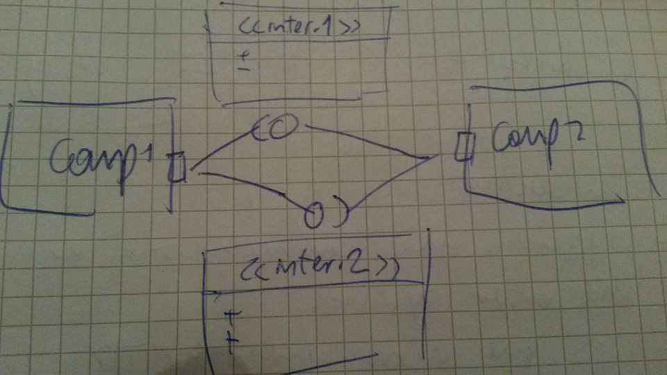

# Foundations of Object Oriented Modeling and Design

## Software Development:
- Ideal: direct mapping from problem domain to implementation model
- Real:
    - work with model no real things
    - the implementation is not the one expected 

## Model based design:
- Model is interesting because it "tries to catch the problem as good as possible". Before implementation.
- Language should be precise
- Quality assurance: Constructive (object orientation) and Analytical (verification and validation).

## System:
- Small parts that works together, in an organized way, to full fill a specific task.

###  Systems engineering: 
- It is an **interdisciplinary approach** that concerns with all the aspects of the development and evolution of a successful system or product. 
- It considers both the business and technical needs of the **customers**.
- System engineers are involved in specify the overall architecture, and then integrating the different parts to create the finished system. 
- It focuses in analyze system requirements in order to develop a quality product.

### Software engineering: 
- is an engineering discipline that is concerned with all aspects of software production from initial conception to operation and maintenance. 
- It is focused on the quality
- It has well-defined principles
- It is a critical task, complexity is always increasing

## Extra definition:
- Software: Computer programs and associated documentation. Software products may be developed for a particular customer or may be developed for a general market.
- What are the attributes of good software?  Good software should deliver the required functionality and performance to the user and should be maintainable, dependable and usable.

## Model: 
- Abstract and simplified representation of something

## Design:
- It the process of defining things (interfaces, architecture, components)  and results (documentation)
- Create abstract implementation model

## Role of Design:
### Waterfall model:
- In principle at least, you plan and schedule all of the process activities before starting software development.
- Parts of the system that are well understood can be specified and developed using a waterfall-based process
- The Stages:
    - Requirements analysis and definition: established by consultation with system users. defined in detail
    - System and software design: allocates the requirements, system architecture, system abstractions and relationships.
    - Implementation and unit testing: 
    - Integration and system testing: after testing the software is delivered to the customer
    - Operation and maintenance: longest life-cycle phase
- Usually the results of each phase are documents
- Suitable for:
    - Embedded systems where the software has to interface with "inflexible" hardware systems. 
    - Critical systems where there is a need for extensive safety and security analysis of the software specification and design. Safety related problems are usually very expensive.
    - Large software systems that are part of broader engineering systems developed by several partner companies. Furthermore, where several companies are involved, complete specifications may be needed to allow for the independent development of different subsystems.

### V-Model
- Shows the software validation activities that correspond to each stage of the waterfall process model.
- Direct map between conceptual level and testing level
- There are feedback between blocks.
- Its phases:
    - Analysis
    - Coarse design: description of software architecture (decompose into subsystems, identify components, relations and cooperation between components).
    - Detailed Design: Component design (determine interfaces)
    - Implementation

### Spiral Model

{width=50%}

- Take into account iterations
- Typically starts with risk analysis.
- Phases:
    - Negotiation: with stakeholders, users (objectives, constrains, strategies)
    - Evaluation: Make or buy analysis
    - Implementation and testing: components, prototypes 1,2,... and final product
    - Planning: the next stage, review the product


Each loop in the spiral represents a phase of the software process. Thus, the innermost loop might be concerned with system feasibility, the next loop with requirements definition, the next loop with system design, and so on. The spiral model combines change avoidance with change tolerance. It assumes that changes are a result of project risks and includes explicit risk management activities to reduce these risks.

### RUP Model (check slides)

{width=75%}

- Design is important, spans through almost the whole life-cycle
- It's possible to know the efforts in each phase
- Requirements may change overtime
- Parallel
- Within each iteration, the tasks are categorized into nine disciplines:
    -  Six "engineering disciplines"
        - Business modeling
        - Requirements
        - Analysis and design
        - Implementation
        - Test
        - Deployment
    - Three supporting disciplines
        - Configuration and change management
        - Project management
        - Environment

### Propagate the change:
- Iterative Process:
    - Ensure core functionality first
    - Ensure that required extensions are possible
- Software Architecture and detailed design have to be flexible and extensible

### Life cycle and change
- First law of software evolution: software must be continually adapted or it will become less and less satisfactory
- First law of systems engineering: No matter where you are in the system life cycle, the system will change and the desire of change will persist throughout the entire life cycle.
- Software will change during maintenance

## Software Quality requires design: (READ slides)
- Importance of software design: **quality**
    - Translate accurately requirements into products
    - Still stable systems for small changes
    - Otherwise difficult to test
- If there is a good design, it will be much simple to update a system.
- What are the attributes of good software?  Good software should deliver the required functionality and performance to the user and should be maintainable, dependable and usable.
- Good design: 
    - User view (easy to use, stable, efficient, performance)
    - Administrative/ Deployment (interoperability) 
    - view and Internal view (well documented, reusable, easy to maintain, portability))

### Design principles:
- Separation of concerns: 
    - Group tasks that belong to the same concern
    - Try not to focus on the whole system as a unit
    - Breakdown the system, develop and design each part
- Information hiding:
    - Hide design decisions within modules especially when changes are expected
    - Work with black boxes (interfaces)
    - Maintainable and extensible
- Abstraction: Focus on giving the relevant information to a particular purpose.
- Modularity:
    - Modularization: the process of breaking a system into components to facilitate design and development
    - Encapsulation: A software development technique that consists of isolating  a system function within a module and providing precise specifications for the module
     no coupling (full independent), functional (strong dependency)

### Object orientation
- An object has states and behavior
- Classes: abstraction that defines properties and characteristics of an object, are used as templates for objects.
- Usually we think in an oriented-object way

### Structured Analysis and Design
- Classes are used at all levels.

### OO & Modularity: 5 Criteria (READ SLIDES)
- Decomposability
- Composability
- Understandability
- Continuity
- Protection

### OO & Modularity: 5 Rules (READ SLIDES)
- Direct mapping
- Few interfaces
- Small interfaces 
- Explicit interfaces
- Information hiding

### OO & Modularity: 5 Principles (READ SLIDES)
- Linguistic Modular Units
- Self documentation
- Uniform access: All services offer by a module should be available through a uniform notation, which does not betray whether they are implemented through storage or through computation. 
For example in Ruby:

```ruby
#Setters are like:
 journey_plan.title = "South West Journey_plan"

#Getters are like:
 journey_plan.title
```

- Open-Closed Principle
- Single choice: The goal is to put things which change for the same reason into the same place.
Structurally, it is a matter of inverting a nested relationship:

```
  Variation 1
  --operation A
  --operation B
  Variation 2
  --operation A
  --operation B
  etc...
```

Versus:

```
  Operation A
  --variation 1
  --variation 2
  Operation B
  --variation 1
  --variation 2
  etc...
```

### Object structuring: Limitations
- Object Abstraction results usually in stable entities, the requirements may change.
- Encapsulation is sometimes weak

### Software components
A software component is a unit of composition with contractually-specified interfaces and explicit context dependencies only. A software component can be deployed independently and is subject to composition by third parties. 

-----
# Introduction to UML (NEED TO STUDY FROM HERE)
- It is a visual language
- Neutral: independent form language programming
- **Model**: abstract representation of a systems
- **Diagram**: correspond to one view of a model
- UML diagrams illustrate  the quantifiable aspects of a system that can be described visually
- Types: 
    - Structure Diagrams
    - Behavior Diagrams 

Some good [tutorial](https://www.youtube.com/watch?v=UI6lqHOVHic)

# Class Diagram
- Based on Entity-Relationship-Model: Conceptional model to describe the structure of data (Entities) and the relationship between the data.

- Tasks:
    - Analysis: identify object model of system and context (environment)
    - Design: design object model of the systems
    - Implementation: realize object model of the system

- UML Class diagrams:
    - Consists of definitions of classes and relation types
    - Classes: define structure (attributes) and behavior (signature of operations) of uniform objects
    - Relation types: define relation between objects

## Analysis Phase
- Step 1: Determine relevant classes of problem domain: all substantives  are candidates for classes
- Step 2: not relevant classes are eliminated
- Step 3: determine attributes and operations
- Step 4: determine relations between objects (Association, Aggregation) 
- Step 5: Determine common properties of different classes. Define common properties in a common super class
- Step 6: Repeat step 2 to 5 till class diagram is stable

## Design Phase 
- Analysis:  Analysis model of the problem domain
- Design:
    - Define the software architecture (coarse design):
        - Decompose system into subsystem
        - Identify components
        - Relations and cooperation between components (connectors)
        - Result: architectural description
    - Detailed Design
        - Determine interfaces (contracts)
        - Result: component specification - Identify properties in your system (and model) where e.g. flexibility is required. Apply design pattern 
- Important: Analysis model  **IS NOT EQUAL TO** Design model!

----
# Object Diagram
- Emphasize the relationship between instances of classes
- Use a subset of elements of a class diagram
- template for object (instances)

# Behavioral Model 
## Interactions and Collaborations
- Interaction: a collection of communications between instances, including all ways to affect instances, like operation invocation, as well as creation and destruction of instances
- The communications are partially ordered (in time)
- Show interactions between instances in the model
- is focusing in communication between concrete objects, includes all possible effects of the communication
- show when the instances are creating or deleting
- ordering of the  operations
- **Sequence Diagram**:
    - Sequence diagram is the most common kind of interaction diagram, which focuses on the message interchange between a number of objects 
    - has simple semantics in a specific point of time
    - Specifies timing intervals
    - one possible communication is representing
    - show message interaction between objects
- **Collaboration/Communication Diagram**: 
    - structural effects
    - representation of a concrete possible diagram includes and ordering of calls (check this line)

### When to use Model Interaction
- To specify how the instances are to interact with each other.
- To identify the interfaces of the classifiers.
- To distribute the requirements.

### Interaction Model Tips (super important)
- Set the context for the interaction. Context must be simple and clear
- Include only those features of the instances that are relevant.
- Express the flow from left to right and from top to bottom.
- Put active instances to the left/top and passive ones to the right/bottom.
- Use sequence diagrams
    - to show the explicit ordering between the stimuli
    - when modeling real-time
- Use collaboration diagrams
    - when structure is important
    - to concentrate on the effects on the instances

---
### What is collaboration
- Collaboration defines the roles that a set of instances play when performing a particular task, like an operation or a use case
- Interaction specifies a communication pattern to be performed by instances playing the roles of a collaboration.
- An instance can have more than one role
- Pattern is a solution used many times 

### When to use Model Collaborations
- Use Collaborations as a tool to find the classifiers 
- Trace a Use Case/ Operation onto classifiers 

### Collaboration Modeling tips
- A collaboration should consist of both structure and behavior relevant for the task
- A role is an abstraction of an instance, it is **not** a class

### Wrap up
- Instances, Links and Stimuli are used for expressing the dynamics in a model
- Collaboration is a tool:
    - Identification of classifiers 
    - specification of the usage of instances
    - expressing a mapping between different levels of abstraction
- Different kinds of diagrams focus on time or on structure

## State Charts (From here)
### Automata
- A machine whose output behavior is not only a direct consequence of the current input, but of some past history of its inputs
- Characterized by an internal state which represents this past experience

### Mealy state machine
- a set of input signals
- a set of output signals
- a set of states
- a set of transitions
- a set of extended state variables
- a set of final states
- an initial states

### What kind of behaviors?
- Discrete behaviors
- Event driven behaviors
- Event: a type of observable occurrence

### Wrap up:
- Used to model event-driven
- Includes a number of sophisticated features that realize common state-machine usage pattern
- Provides a hierarchical modeling

## Activity Diagram
- The difference in the three models is how step in a process is initiated, specially with respect to how the step gets its inputs
- Method or business behaviors are specified 
- Control flow and object flow
- specify behaviors of an operation
- Action is the core: an action is used for anything that does not directly start another activity graph. However, an action can invoke an operation that has another activity graph as a method.

### When to use activity diagrams
- The behavior does not depend much on external  events
- has steps that run to completion, rather than being interrupted by events
- requires data/object flow between steps
- Not many or none exceptions 
- You are concerned with which activities happen, rather than which objects are responsible for them.

### Wrap up:
- Use activity diagrams for application that are primarily control and data-driven
- not for embedded systems (event driven applications)
- control and data/object flow do not have separate semantics

## Interaction Diagram (DRAFT VERSION AFTER SLIDES - need to check with our homework)
- Form of activity diagram 
- Try to model how different diagrams work together

## Use Case Diagram 
- view of a system that emphasizes the **behavior** as it appears to outside **users**. 
- External visible activities that interacts with the system
- Functional requirements
- Include: For example "Driving a car" is include in "using a car"
- Extend: For example "Turn on a radio" is an extension but it is not need to "using a car"
- Note the direction of the arrows when using _include_ and _extend_

### Use Case Description
- Is a textual way to represent use case diagrams 
- Preconditions: it is written
- Actor: an actor could be anything (another system, client, database)

### When to model Use Case Diagram 
- A use case model partitions system functionality into transactions (‘use cases’) that are meaningful to users (‘actors’).  
- Could be possible to use it as a starting point for analysis.
- Model user requirements with use cases.
- Model test scenarios with use cases.
- If you are using a use-case driven method: start with use case and then use structural and behavioral diagrams 
- If you are not using a use-case driven method: make sure that your use case is consistent with your structural and behavioral diagrams.

## Timing Diagram
- Timing diagrams show change in state or other condition of a structural element over time. 

## Implementation Diagram
- describe the different elements required for implementing a system Component diagrams

### Component Diagram
- Modular unit with well-defined interfaces that is replaceable within its environment
- **Autonomous** unit within a system
- The only way to communicate with components is by using interfaces
- We can specify the port behavior
- Interfaces:
    - Is the definition of a collection of one or more operations
    - Provides only the operations but not the implementation
    - Implementation is normally provided by a class or component
- Component:
    - Specifies Contracts (methods) of the services that are provided or required 
    - Can be replaced
    - The system can be extended
- Ports:
    - All interactions of a component with its environment are achieved through a port
    - The internals are fully isolated from the environment
    - This allows using a component in any context that satisfies the constraints specified by its ports

### Deployment Diagram 
- Are used to show the nodes where software components reside in the run-time system
- Show the hardware of the system
- Map the software it the specific hardware elements
- The idea is to represent a real physical environment
- Node: usually represents a piece of hardware
- Artifact: it is kind of executable, binary file, source code

### Example
This is an example of the component diagram:


We can model the behavior of the port by using a sequence diagram:


But also it is possible to use state diagram to model port behavior

