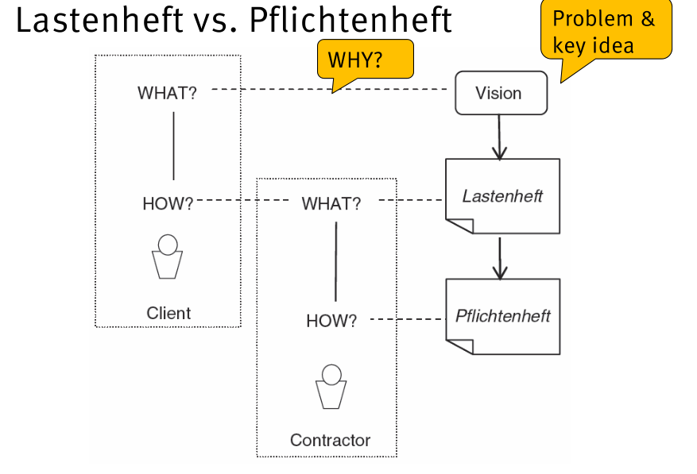

# Ch01: Introduction
Reasons for project success:
    - Without result: a manager or someone changes the status of the project as _closed_ or _finished_.
    - Realistic expectation: user and management views. The  user may ask for something that it is not possible under certain circumstances.
    - Clear statement of requirements
    - Management support 
    - Experience project manager
- Motivation: 
    - legal perspective: contracts
    - keep the supply chain working

## What is a requirement
- Requirements are presented in  natural language:
    - everybody can understand it
    - it is powerful, UML cannot model quality for example.
    - user are most likely to not understand UML
    - But natural language may be unclear
- A requirement is:
    - a need of the user or stakeholder
    - a capability or property that a system shall have.
- **def**: Soren Lausen: “A requirement specification is a document that describes what the system should do.”
- It is given from the perspective of the system (check examples in slides for more information).
- What and how depends on the perspective. It is not always easy to identify requirements.
- Requirements talk about real word, what the user can observe
- Some requirements are not visible to the system.
- **Specifications**: 
    - Are things that the system can observed and it is also observed in the real world.
    - Are implementable
    - Should meet the requirements, the assumptions can be wrong
- **Functional Requirement**: 
    - explains the what
    -  A requirement concerning a result of behavior that shall be provided by a function of a system.
- **Quality Requirement**: 
    - How good? How can you specify reliability and maintainability
    - How to measure so we make sure we meet the requirements
    - A requirement that related to a quality concern that is not covered by functional requirement
 
## Constrains 
- Requirement gives to much room, so we must constrain the requirement
- Additional constrains that are not covered by functional requirements

## What is requirements engineering
- A systematic approach for delivering requirements 
- **Goal**: minimize the risk of delivering a system that does not meet the stakeholders’ desires and needs
- Ingredients:
    - Knowing your stakeholders 
    - understanding the stakeholders’ needs
    - achieving a consensus among the stakeholders about requirements
    - documenting them according to given standards
    - managing them systematically to cope with changes
- Is an informal process, it is hard to subdivide in procedures
- It is a phase, it is a continuous activity
- It is a part of the software development life cycle
- It is the basics for  verification
- Traceability is very helpful to decide whether the software development may change due to new requirements 

## Some empirical data
- Misconception or misunderstanding in the requirements phase are the main cause of failures in the test phase. 

---
# Ch02: RE in a nutshell 
## Where do RE come from?
- from stakeholders

## Who analyzes the requirements
- A requirements engineer / business analysis / product manager.

## Project Type
- In-house: requirements are there
- Product dev: new product for a market
- Time and materials:
    - built a customer with effort
    - External company gives the order to develop a product
    - It's to risky
- COTS (commercial off the shelf): 
    - somebody is selling something to you
    - Need high level requirement engineering to systematically evaluates products
- Tender: company selects supplier in a bidding process
- Contract dev: third-parties companies develop parts of the software
- Unknown: no idea what to do

## Corner stones of RE
- 3x3 Model:
    - Real world:
        - System 
        - Context/ environment
    - Activities: 
        - Research information
        - design, decision making
    - Documentation:
        - What the system is actually doing
        - requirements vs specifications

## Activities: 
- Communications
    - Noise, infer what other people is trying to say
    - Not all the information is given
    - Neuro linguistic programming 

- Design/ decisions:
    - Design implies decisions about:
        - Framing the problem
        - Shaping the functionality of the system
        - Selecting technologies
    - Design requires innovation & creativity
    - Design follows rationales

## Documentation 
- Typically two kinds of documentation:
    - User requirements
    - System specifications
- What the user wants
- Functional requirements: in form of a function, it receives an input and return and output

### Domain and product level
- Systems can have subsystems
- the domain describes user activities. the activities are more constant than interfaces
- Domain-level req: The product shall support user activities (Tasks and support)
- Product-level reqs: The product shall accept input.(features)
- Product level requirements
    - shows the why by correcting requirements
    - the goals are very short
- Asking the **why** can give you information about the real requirement
- Consumers tend to think to concrete in the sense that one think on concrete objects
- the **how** helps to get the idea down when it is too abstract
- it is a fast approach, but no very precise
- Design level information can be used as a complement of some requirements 

## Real World
- What we are doing have an impact on what we perceive
- Requirement should not be technology biased, but since the How includes technology it is not always possible to set requirements that are not based on a specific technologies

# Ch03: Documentation
- Motivation:
    - Persistence: without documentation it is hard to remember the requirements
    - Common reference: all the participants have the same information
    - Promotes communication: the requirements are analyzed
    - Promotes objectivity: minimize subjective interpretation
    - Training of new employees: basis to be familiar with the project
    - Preserve export knowledge
    - Helps to reflect the problem
- Examples: ambiguous, not verifiable, not atomic
- Pros and cons of using both natural language and models:
    - Hard to link natural language (informal) with models
    - Models typically captures one aspect
- Ingredients:
    - Good structure, organization
    - Precise meaning
    - Semantics
    - Good practices (atomic)
    - think on the reader
- Lastenheft:
    - legal contract between costumer and supplier
    - define miles stones in project manager
- Pflichtenheft:
    - design and information
    - reference for verification and validation
    - basis for change and release management
    - to derive user manual

## Standards for Requirement Documents
- It's a contract between writer and reader
- It's also a checklist
- Reference for validation
- System and project specific

- System specific requirements (read slides)
- Project specific requirements (read slides)
- Requirement pattern
    - WHEN SYSTEM_NAME (should/shall/will) PROCESS OBJECT
    - when: under what conditions
    - “shall” indicates a legally binding requirement
    - “should” indicates a requirement that is highly recommended but would not make the system unacceptable if it is not implemented.
- Example:
    - R114: If the glass break detector detects the damaging of a window, the system shall inform the head office of the security service. 
    - [<When>: If the glass break detector detects the damaging of a window] THE SYSTEM SHALL [<Process>: inform] [<Object>: the head office of the security service]. 

## Hierarchy of requirement documents
- System Requirements: 
    - Requirements subsystem A
        - Requirements subsystem A.1
    - Requirements subsystem B

## Goal analysis 
- It's particular to requirement engineering
- Goal: describes an intention with regards to the objectives, properties or use of a system
- It's easier to resolve conflicts in the goal phase
- Tend to be more stables overtime
- Benefits:
    - Better understanding of the system: clarify the value of the system
    - Elicitation: goals drive and guide the elicitation of requirements 
    - Systematic identification and evaluation of alternative realizations: by decomposing goals into sub-goals, alternative realizations can be identified systematically. 
    - Rationales for requirements: requirements without rationales are irrelevant
    - Low effort: Modeling goal does not imply a significant additional effort compared to the overall effort for RE. 
- Goals are decompose into sub goals:
    - AND decomposition: all sub-goals must be satisfied in order to satisfied the main goal
    - OR decomposition: not all sub-goal must be satisfied (used as alternative strategies)
    - The documents must make clear if a sub-goal is AND or OR

## Goal Hierarchy
- The top most goal is called vision
- Vision > goals > requirements > design > implementation
- Vision: try to catch the essence of the project. The ultimate answer to all Why

## iStar approach (Read SLIDES)
- Proposed to document and analyze goals
- Task (use cases)
- includes quality goals (really important)
- Goal is something measurable in some sense
- Strategic Dependency Model (SDM)
    - Captures the dependencies between actors
- Strategic Rationale Model (SRM) 
    - Describe the internal rationale structure of the actors
- Dependum: help to characterized the association between actors
- Soft-goal: is related to quality

### Strategic Dependency Model (SMD)
- Actor: person/ system that has relationship to the system to be develop
- Resource: what the actor needs to achieve a goal or perform a task. It's important to know if the resource is available and from whom
- Soft goal: a condition in the world which the actor would like to achieve which is not sharply defined. It is a quality attribute of a goal, task, or a resource.
- Goal: answers why? questions. Achievement can be measured.
- Task: consists of a number of steps that an actor needs to perform to execute the goal.

### Strategic Rationale Model (SRM)
- Models the stakeholders interests and how they might be met.  That is, it describes the capabilities of an actor by detailing its internal structure.
- Actor boundaries indicate intentional boundaries of a particular actor. All of the elements within a boundary for an actor are explicitly desired by that actor. 
- Mean ends link: describe how a goal is relized.
- Contribution link: describe the impact of the soft goals
- The root cause of conflicts in requirements are conflict goals
- The goals are redundant information, the main focus is on actors and boundaries

## Data Requirements (NO SLIDES)
- Describes the data that goes in and out
- Avoid implementation details
- There is a dependency between data and task
- Data dictionary: helps to express the data rules
- Basis for functional requirements

## Functional Requirements  (NO SLIDES)
- Who does what
- Design decision
- Context Diagram:
    - is used to make design decisions
    - comes from structural programming
    - The boundaries can be drawn in different ways
    - surroundings: what it is given
    - System is what we have to design 

### Event list and function list
- "Use cases" is used to get feature requirements
- to complement the specification we use screens and prototypes
- Traditional functional requirements it's not good for COTS 

### Task description
- Applicable whet the users have a big role
- In use case the actors and the system are separated
- Task: should "tell a story" (task vs feature)

