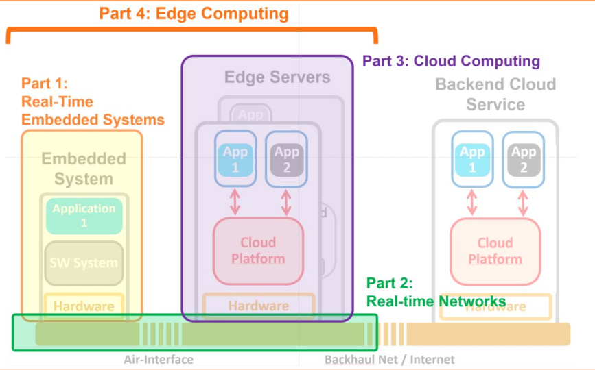
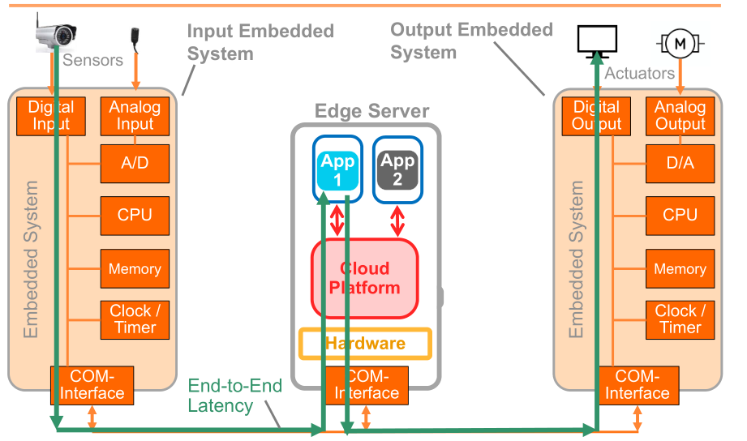
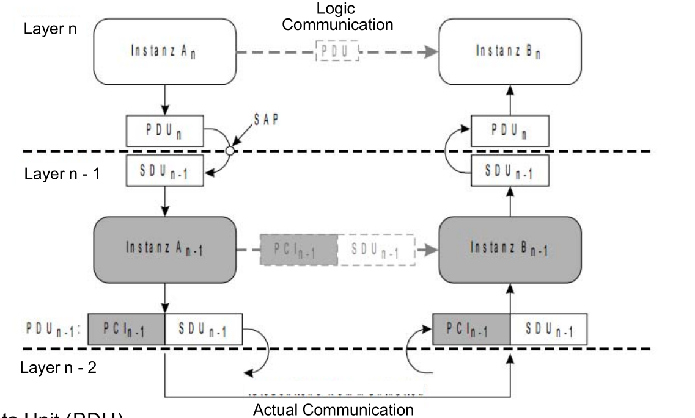
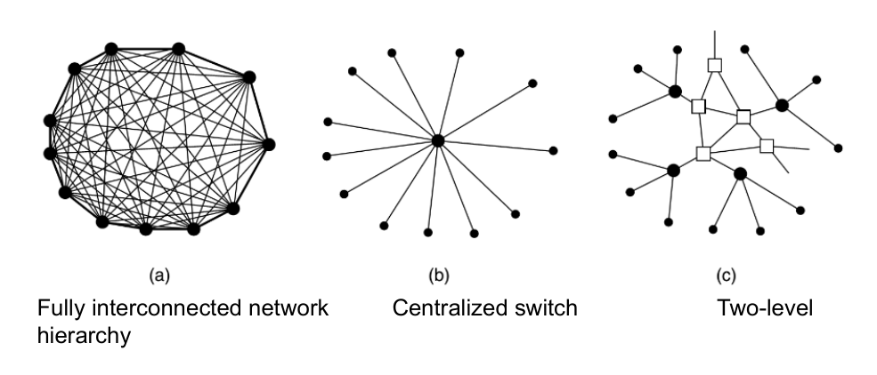
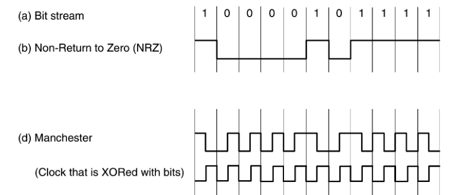
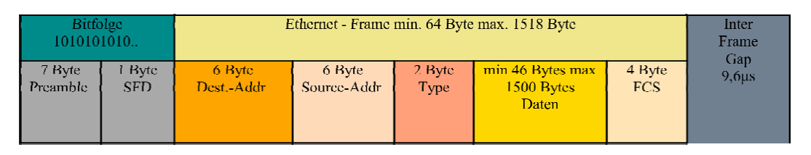

# Introduction
- **Def**: Internet of things is the network of embedded systems and connectivity which enables these objects to connect and exchange data.
- Mobile computing (embedded systems) and cloud computing are slowly drifting apart
- We need connected compute power and storage close to mobile devices and embedded systems
- **Edge Computing**: Little data centers and computing resources right next to the mobile device or sensor
- **Def**: Edge computing builds something that connects cloud computing and embedded systems that provides storage and computation
- Characteristics:
    - Low latency
    - Edge stations / servers work as "Cache memory"
- Application: big data, virtual reality, drone support services, online gaming

# Real-Time Embedded systems
## Common Characteristics
- Dependability: 
    - Reliability: probability of a system to work as expected
    - Maintainability: probability of a system to work correctly _d_ time units after an error occurred
    - Availability: probability of a system to work on request at any time
    - Safety: no harm to be cause
    - Security: confidential and authentication  communications 
    - Even perfectly designed systems can fail if the assumptions about the workload and possible errors turn out to be wrong
- Efficiency:  Code size, run-time, weight, cost, energy
    - There is a trade-off between low energy consumption and flexibility (multi-purpose)
- Real-time constrains:
    - A real-time system must response to an stimuli from the controlled object within an interval given by the environment
    - Hard real-time system: if the deadline is not met, it will have catastrophic consequences

## Embedded Systems Hardware
 - Input
    - Embedded systems hardware is frequently used in a loop (hardware in a loop)
    - Sensors: 
        - can be designed for virtually every physical and chemical quantity
        - Measure signals; **signal** is a mapping from time domain to value domain, can be continuous or discrete
        - Discretization of time: Sample and Hold (transistor + capacitor) and A/D converters (Flash ADC - comparator + Encoding)
        - Types: 
            - Basic sensor (chemical/ physical quantity but not electrical)
            - Integrated sensor: basic sensor + signal processing (filtering usually)
            - Intelligent sensor: integrated sensor + preprocessing (fusion, pattern recognition)
- Processing
    - Microcontroller: CPU + Memories + Peripherals, also could have Interrupt system, watchdog, debugging interface, and oscillator
    - Examples of ARM processors (CHECK SLIDES)
    - Trend: multiprocessor system-on-chips (MPSoC)
- Memories
    - Efficiency is a concern (capacity, speed, energy, predictable timing, size, cost, etc)
    - Types:
        - SRAM/ DRAM: Data is lost as soon as power is switched off, for run time data
        - Flash: Typically 10K write cycles, write only block-wise, not always is possible to read, for program code
        - EEPROM: Typically 100K write cycles, access is always indirect, byte-wise access, for configuration
    - Trends: Speed gap between processor and main DRAM decreases, Memory access time is much lower than processor access time. Hierarchical memories using scratch pad memories (SPM) which are small but physically separate memory mapped into the address space. They are mostly suited for storing temporary results. More info [here](https://en.wikipedia.org/wiki/Scratchpad_memory).
- Output:
    - OPAMPs (amplify voltage, impedance)
    - DAC
    - Actuators: influence physical processes based on electrical signals

## Embedded Systems Software
- Real-time Operating Systems
    - Embedded operating systems: Configurable, devices are handle by tasks, protection is optional, real-time capability
    - Configurability:
        - Avoid overhead of unused functions
        - Conditional compilation 
        - Linker time optimization (removal of unused functions)
        - Dynamic data might be replaced by static data
    - Devices are handle by tasks
        - Effectively no device needs to be supported by all variants of the OS
        - Disk and network handle by tasks instead of integrated drivers
    - Protection is optional
        - Sometimes it's not required
        - However, protection mechanisms may be needed for safety and security reasons
    - Interrupts not restricted to OS
        - Interrupts can be employed by any process
        - More efficient than going through OS services
        - Reduce composability, if there is direct mapping of a SW to an interrupts, it means that another SW cannot use it.
    - Real-time capability: Many embedded systems are real-time systems, hence, the OS should have that capability as well
        - **Def** real-time operating system is an operating system that supports the construction of real-time systems
        - The time behavior of the OS must be **PREDICTABLE**
            - OS should manage the timing and scheduling (aware of task deadlines, precise time services with high resolution)
            - Time synchronization (universal clocks)
            - Synchronization with one master clock or Distributed synchronization (christian's algorithm, Berkeley algorithm)
            - Problems with external synchronization: erroneous values are copied to all stations, many time formats are too restricted
        - The OS must be fast
            - RTOS-Kernels: include resource management (processor, memory, timer), task management and synchronization.
                - Fast RTOS: are fast but not predictable (QNX, VxWORKS, VCOS)
                - RT extensions to standard OSs: RT-task cannot use standard OS services but if the OS crash the RT-task still working (RT linux, RTAI, FreeRTOS)
                - Research trying to avoid limitations

- Resource Access Protocols
    - **Critical sections**: sections of code at which exclusive access to some resource must be guaranteed.  Can be guaranteed with semaphores S or “mutexes”. Example SLIDES
        - P(S) checks semaphore to see if resource is available and if yes, sets S to “used“ and perform _uninterruptible operations_. If no, calling task has to wait.  V(S): sets S to “unused“ and starts sleeping task (if any).
        - Blocking due to mutual exclusion: Priority T1 assumed to be greater than priority of T2.  If T2 requests exclusive access first (at t0), T1 has to wait until T2 releases the resource (at time t3):
        - PATH FINDER EXAMPLE (SLIDES)
        - the priority inheritance protocol: (CHECK [DPS](https://github.com/daleonpz/Notes/blob/master/fh-dortmund/01-DPS.md) ). Problem: deadlock due to circular or nested blocking
        - Remarks on priority inheritance protocol
            - Priority inheritance protocol solves the problem of priority inversion
            - Limitations: Possible deadlocks,  Possibly large number of tasks with high priority
            - Protocol with further improvements: priority ceiling protocol (for fixed set of processes)

- Scheduling in real-time Systems: READ SLIDES 

## CHECKPOINT 
- What is Internet of Things? 
- What is Edge Computing?
- What are key drivers of Edge Computing?
- What are common characteristics of embedded systems?
- Describe the two types of discretization?  How can they be implemented?
- What are the elements of the embedded systems control loop?
- Processing energy efficiency: ranking per type of processor? 
- What is a Microcontroller? 
- What is a System on Chip?
- Characterize the memory types (RAM, Flash EEPROM)!
- What is the memory wall problem?
- Give an example of a D/A Converter!
- What are essential features of embedded operating systems?
- What are key requirements of RT operating systems?
- What is the problem with exclusive access to resources in embedded systems?
- What is the priority inversion problem? How can it be solved?
- What is the problem of deadlocks?
- What is a schedule?
- Provide a classification of scheduling algorithms! What is the difference between static and dynamic scheduling?
- What is schedulablity? What is a cost function?
- How do the scheduling algorithms work: EDD, EDF, LL?

## Real-Time Embedded Systems and Edge Computing
- **Def** Edge Computing: small data centers at the network edge that offer connected compute and storage resources right next to the user
- Example Use Cases: Virtual reality application connected with head mounted display,  Analyzing large volumes of data right at the edge (Edge Analytics)
- Reduced latency through Edge Computing

- Input Embedded Systems - Sources of Latency:
    - Input sensor latencies:  
        - Analog / digital sensors: measurement time
        - Integrated Sensors: all embedded systems latencies
        - Sensor data transfer: all communication latencies
    - Input data processing latencies:
        - Analog to digital conversion and Discretization
        - Decoding / data conversion latencies
    - HW-related latencies
        - Clock sync time
        - CPU processing speed
        - Memory access time
        - Internal bus communication
    - Software-related latencies
        - Processing time in kernel, drivers, middleware, applications
        - Access to resources (mutexes etc.), blocking etc.
    - Scheduling-related latencies
        - CPU idle time, lateness, task switching, scheduling overhead etc.
    - Communication-related latencies 

- Output Embedded System - Sources of Latency
    - Output data processing latencies:
        - Decoding / data conversion latencies
        - Digital to analog conversion and signal shaping
    - Output actuator latencies
        - Output data transfer: all communication latencies
        - Output system latencies

- Real-time Embedded Systems - Sources of Latency
    - Start-up latencies
        - Sensors & sensor communication
        - Clock start-up and sync Software boot time (kernel, drivers, middleware, applications)
    - Wake-up latencies
        - Clock-speed increase after power-safe mode
        - Re-activate CPU / DSP´s systems after power-safe mode

# Real-time Networks
## Fundamental Concepts
- The OSI reference model, setup and mode of operation
    - Defined in ISO norm 7498, the Reference Model for Open System Interconnection (OSI) presents a model for the representation of inter-computer data exchange.
    - Important protocols, i.e. TCP/IP or SNA (System Network Architecture, IBM), already existed when the OSI model was standardized by ISO. Therefore, these protocols not always abide by the architecture as described by the OSI model.

- Layers, services and protocols
    - The OSI model defines seven layers. Components assigned to such a layer use services of the subordinate layer while offering their own services to their superordinate layer. The interface between these layers are defined by so-called **service access points (SAP)**. Every layer concerns itself with a part of the functions necessary for the exchange of information between computer systems.
    - Every instance of layer n strictly communicates with another instance of layer n in the opposite computer system. The data exchanged between these layers takes the form of **protocol data units (PDU)**.
    - During the exchange of data, every layer uses services of its subordinate layer.  Every data packet therefore travels through layers 7 to 1 of the sending system, is send over the physical medium to the target system and reaches the receiving application by travelling through layers 1 to 7.  
    - PCI: protocol control information

- Layer functions
    - Layer 1 - Physical Layer: encompasses the physical transfer of bits between the computer systems. This includes gaining access to the medium and its physical properties.
    - Layer 2 - Data Link Layer: This layer manages incoming and outgoing streams (divided into packets) of data, and also offers control mechanisms for the detection of bit errors
    - Layer 3 - Network Layer: The network layer handles switching-oriented functions. This includes the routing services. While the data link layer (layer 2) is only responsible for the transmission between two successive transmission mediums (such as end or transit systems), the networks layer handels the transmission from the sender to the eventual receiver.  This is the uppermost layer absolutely required to send data.
    - Layer 4 - Transport Layer: Layer 4 acts as the border between the lower, transport oriented layers and the upper, application-oriented layers. At this level, the network used for data exchange is no longer relevant. Layer 4 only deals with the addresses of the sending and receiving systems, and control flow and transmission errors. .
    - Layer 5 - Session Layer: This layer no longer deals with single connections, rather managing sessions, a logical connection between two applications of the uppermost layer.
    - Layer 6 - Presentation Layer: The presentation layer handles conversion between different encodings, such that both applications may communicate with each other.
    - Layer 7 - Application Layer: The last link between transmission medium and application, this layer holds the actual connection to the application process. 

## Physical Layer and Data Link Layer

- Encodings
    - Source encoding: Assigment of source data to a binary representation, reducing redundant data (data compression)
    - Channel encoding: Adding redundancy to check for transmission errors, e.g.  parity bit, CRC (Cyclic Redundancy Check)
    - Line coding: Assignment of digital data elements to analog or digital signal elements of the transmission line

- Baseband Transmission, Carrier-bound Transmission
    - Baseband transmission: Transmission of an analog or digital signal over the medium without modulation. The signal is transmitted using the original frequency range.
    - Carrier-bound transmission: Transmission of signals using a modulation. The signal is transmitted in the carrier‘s frequency range.

    - Properties of encodings;  Direct current-free (DC-free), Own provisioning of the clock signal (self synchronized)
    - Often-used line codings:
        - NRZ: Not Return to Zero, not DC-free, not self synchronized
        - RZ: Return to Zero, not DC-free, not self synchronized
        - Manchester: Ethernet, DC-free and self synchronized
        - AMI: Alternate Mark Inversion, three levels, DC-free, not self synchronized
    - Properties of digital line codings, clock recovery
        - All Manchester encodings allow for clock recovery, but need twice as much
bandwidth as the NRZ code.
        - The NRZ code does not provide clock recovery due to not providing a state change when receiving unfavorable bit strings. Using this code therefore requires bit conversion to avoid many '0' in a row, for example (4B/5B conversion) 

- Temporal inspection of collision detection (worst case)
    (a) A sends Packet (t = 0 )
    (b) The packet has almost reached B (t ≈ τ )
    (c) B sends packet due to line being detected as free ⇒ collision occurs (t = τ )
    (d) Destroyed packet reaches A after t = 2τ

- Collision detection
    - Depending on: Bit rate, Minimal frame length, Maximum cable length
    - Example:  Bit rate 10 Mbit Ethernet, Minimal frame length 64 Byte = 512 Bit, Maximum cable length 2500 m
    - Can a collision be detected before the frame is completely send over the line?

    - Propagation speed V: V = 2/3 * 300.000 km/s = 200 ∗ 10
    - Transit time 𝜏 from A to B per bit with s = 2500m cable length:  𝜏 = s/V -> 13 us. 
    - Send time full frame 𝑇  for minimal frame length of 512 Bit: 512 x 𝑇 = 512 * 0,1 µs = 51 us
    - Condition to reach target of collision detection before frame send process is completed: 51us>13us (Condition met! Target may be achieved!)

- CSMA/CD (Carrier Sense Multiple Access/Collision Detection)
    - Ethernet uses a bus structure, both in physical and logical terms. Every packet send reaches all stations and can be read by them (broadcast network)
    - All stations share the transmission channel and therefore compete for its transmission capacity.
    - This competitive situation requires the use of a protocol that guarantees that at any given time only one station is transmitting.
    - The CSMA/CD (Carrier Sense Mutliple Access/Collision Detetion) protocol fulfills this requirement. It exists in several variations.
    - The CSMA/CD protocols are random access procedures. All stations connected to the ethernet may, in principal, access the transmission medium at any time. However, a station may only send data if the medium is currently free (not used by another station), due to two stations sending simultaneously resulting in a collision and the loss of data.  Each station ready to send therefore needs to check the channel for an ongoing transmission (Listen Before Talk, LBT).

- Ethernet frame according to Ethernet II:
    - The preambel is used to synchronize the receiver. It is, including the Start Frame Delimiter (SFD), an oscillation of 6,4 µ s length (8 Bytes of 1010... ).
    - Each frame has a minimum size of 64 Byte in order to reach the minimum timerequired for collision detection to work. If the data is too short, padding is added.
    - As Frame Check Sequence (FCS), the cyclic redundancy check CRC32 is used(Cyclic Redundancy Check with 32 Bit).

- Construction of Ethernet addresses (MAC)
    -  Each MAC address has a length of six bytes (48 Bit).
    - Traditionally, MACs are displayed as a string of six double-digit hex numbers, separated by colons.
    - Bit 0 of the first byte determines if the address is a unicast (0) or broadcast/multicast address (1) handelt. The broadcast address is FF:FF:FF:FF:FF:FF.
    - Bit 1 of the first byte determines if the address is administrated globally (0) or locally (1). Network cards use a worldwide unique MAC address, globally administrated by the IEEE and its vendor.
    - The first 24 bits (bit 3 to 24) of each global MAC contain a vendor number assigned by the IEEE (also known as OUI – Organizationally Unique Identifier).  The remaining bits are assigned by the vendor.

