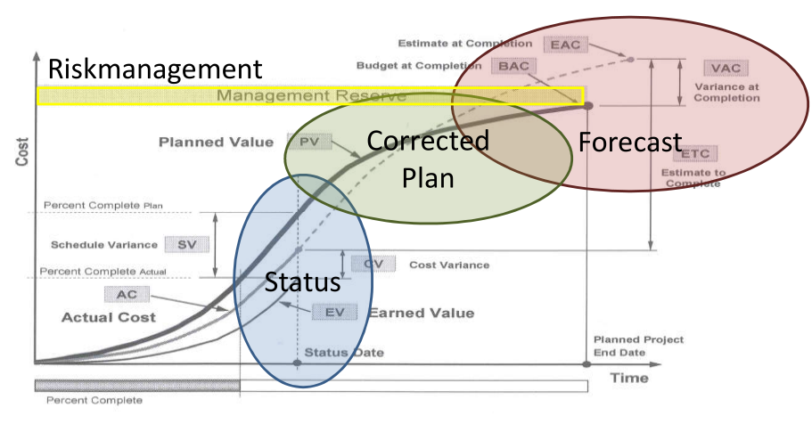

# Characteristic of R&D Projects
## Projects Basis - What is a project?
- A project is a temporary endeavor undertaken to create a unique product, service or result.
- Characteristics
    - Unique: not daily business
    - Endeavor: Has a specific purpose and target
    - Generating something new
    - Temporary: has a beginning and end
- Examples:
    - Good:Constructing an airport, Implementing a new business process
    - Bad: Producing frozen pizza, producing and distributing  electronics
- Rolling wave planning: planning changes overtime and adapts
- Project Field:
    - Product-related: Advanced engineering projects, Product Development projects, volume production support projects
    - General: Process optimization, ratio projects, infrastructure, localization projects and other projects

## Research and Development Basics
- Research:
    - Fundamental research: usually no projects, doing by big companies (small companies usually don't have enough budget)
    - Technology research: take the outcome of fundamental research and find a new application

- Development: 
    - Advanced technology development: think ahead, what will be used in 5-7 years
    - Product/Process development: know what to do and do it

- Value chain: Research (principle/concept) > Development (Application) > Production > Money
- Product related projects: focus also on the product life cycle
- Operation:
    - Ongoing
    - Repetitive
    - Part of organization's core business
    - Ramp-up phase: increase the volume, prototypes

## Project Management Basics – The Vocabulary
- Project: temporary endeavor undertaken to create a unique product, service or result. 
- Program: Group of related projects. Larger effort than a project and may also include operations.
- Portfolio: Project portfolio represents the entire investment in projects and programs and is aligned to the organization‘s strategic goal

- Project Management:
    - Planning: Determination of TARGET value (deadline, cost, results)
    - Monitoring: Establishment of ACTUAL values, comparison TARGET-ACTUAL
    - Controlling: Analysis of discrepancies, introduction of measurements
- Project manager:
    - Organize: the one who decides what to do and when (initializing, execution and closing)
    - Integration: bring all the different disciplines on the table (communication, and high perspective view)

- Process: think of a process as a package of inputs, tools. Outputs from one process are often used as inputs into one or more processes and every process may be performed more than one time on a single process or even within a single phase (Examples in the SLIDES)

- Phases: create phases basically to control (tracking goals or check if something is feasible)  or as checkpoints. To split project into smaller piece, to design the structure of a project, to schedule decision gates, individually for each project ( no standard) and depends on project complexity. Parallel and overlapping phases are also possible (Examples in the SLIDES)

- Gates (Exit gate or kill point): Evaluation of deliverables of one project phase, determine if project should continue  and if next phase should be initiated and  take  the Go/No-Go Decision
- Life cycle: CHECK SLIDES

- Project Roles:
    - Project Manager: ultimately responsible for outcome, Formally empowered to use organizational resources, in control of the project, authorized to spend budget and to make decisions
    - Project Coordinator: Weaker than project manager, may not be allowed to make budget decisions, has some authority to reassign resources
    - Project Expeditor: staff assistant with little or no formal authority, making sure that things arrive on time and the tasks are completed on time
    - Sponsor: Person paying for the project, internal or external (costumer), Valuable project input (due dates, milestones, product features, constrains and assumptions)
    - Stakeholder: individuals who are involved in the project, has positive or negative impact, strong or weak influence, and the most important stakeholder is called "Key stakeholder"
    - Functional Manager: Department manager (head of engineering, director of marketing), "Own" the resources
    - Senior Management: Gives project manager authority and access to resources, resolves conflicts within the organization, issues strategic plans and goals, makes sure that company‘s projects are aligned with plans and goals and help prioritize projects.
    - Project Management Office: Department that supports project managers with Methodology, tools and training, ultimately controls all projects, defines standards and provides best practices.

- Project Context (Org, Influence, Skills): Every project has a context and it is heavily influenced by the type of organization in which it is performed (CHECK SLIDES)
    - Organizational structures: 
        - Functional: project coordination is done by the functional managers or line managers
        - Matrix:  based on responsibilities (Strong, weak, balanced)
        - Project oriented
    - Influence: depending on the organizational structures the influence or power lies functional manager and/or project manager.
    - Skills: Knowledge on project management, regulations/ standards, and project environment.

- Magic Triangle: Scope - Cost - Time
- Business case: 
    - Explains WHY a project is undertaken, the problem it will solve, and the benefit cost analysis
    - Reasons for undertaking a project: market demand, business need, costumer request, social need, ecological impact
    - Project Charter: Document that creates the project, signed by the Sponsor, gives Project Manager the authority to manage the project
    - Project Management Plan: Document that describe the management plan and there are several types (cost, schedule, scope, risk, configuration, quality, requirements plan)
    - Organizational Process Assets: All historical information or knowledge an organization has, which may be used to help. Organization Knowledge Base
    - Enterprise Environmental Factors: Any factor outside of the project’s control that influences the project (laws, government, culture)
    - Statement of work: Written description of the project’s product, service, or result. WHAT is to be done. While the project charter describes the project scope, the statement of work describes the product scope
    - Deliverables: Part of the product, or product itself  that is presented to the customer or stakeholder for acceptance
    - Milestones: A notable event in the project and can be a date, deliverable or a significant point of interest
- Baseline: he original plan PLUS any approved changes. Keep records that show how the plan has progressed and changed 
- Progressive elaboration: An iterative approach where planning occurs in cycles rather than up front. Do some planning, some execution, some monitoring and controlling, and repeat that cycle.
    - Rolling wave planning: A planning technique that does not seek the answer all questions or plan all project activities at the beginning, Instead, only immanent project activities are planned in detail, while activities further are planned at a higher level.
- Lessons learned: Documents focused on variances / deviations that are created at the end of each phase. Lessons learned from past projects are another organizational asset

# Project Management Processes
- 9 Knowledge Areas (PMI)
    - Integration
    -Scope
    - Time
    - Cost
    - Quality
    - Human Resource
    - Communication
    - Risk
    - Procurement 

- 5 Process Group:
    - Monitoring and controlling (is present in all the phases)
    - Initiating > Planing > Execution > Closing
    - Project phase contains all the 5 process groups
    - Project consists in several project phases

- 42 Processes (CHECK SLIDES) 

##  Integration management: 
- Focuses on larger things, it's a high-level view,  has no single/detail work,  is more substantial.
- Making certain that every part is coordinated     
- Project Manager is prioritizing
- Integration = Changes in one area must be integrated into all other
- Initiating: 
    - Develop Project Charter.
    - Key Output: Project Charter
- Planning: 
    - Develop Project Management Plan
    - Key Output: Project Management Plan
- Execution: 
    - Direct and Manage Project Execution
    - Key Output: Deliverables, Work performance information, Change requests 
- Monitoring and Controlling:
    - Monitor and Control Project Work
    - Key Output: Change requests
    - Perform Integrated Change control
    - Key Output: Change requests status updates 
- Closing: 
    - Close Project or phase
    - Key Output: Final product, service, result transition

----
- Develop Project Charter:
    - Document that officially starts the project and it's one of the most important documents on a project and also one of the processes in the project.
    - Lack of a charter causes problems!
    - Inputs: 
        - Project Statement of Work: Includes WHAT is to be done
        - Business Case: Explains WHY the project is being undertaken
        - Contract
        - Enterprise Environmental Factors
        - Organizational Process Assets
    - Tools: Expert judgment
    - Outputs: project charter

- Develop Project Management Plan:
    - Project (Management) Plan is **not** the Schedule (Gantt Chart), and it's progressively elaborated
    - Specifies Who, What, When, Where, How
    - Inputs:
        - Project Charter
        - Enterprise Environmental Factors
        - Organizational Process Assets
    - Tools: Expert judgment
    - Outputs: Project Management Plan

- Direct and Manage Project Execution
    - This is where things are done, and most of a project’s time, cost, and resources are expended here.
    - Team is executing the work packages and creating the deliverables 
    - Inputs:
        - Project Management Plan
        - Approved Change Requests
        - Enterprise Environmental Factors
    - Tools: Execution judgment and project management information system
    - Outputs: 
        - Deliverables
        - Work Performance Information
        - Change Requests
        - Project Management Plan Update
        - Project Document Updates

- Monitor and Control Project Work: 
    - Takes a look at all of the work that is being performed and makes sure that deliverables are in line with the plan comparing work results with the plan
    - Inputs:
        - Project Management Plan
        - Performance Reports
        - Enterprise Environmental Factors
        - Organizational Assets
    - Tools: Expert judgment 
    - Outputs: 
        - Change Requests
        - Project Management Plan Updates and Project Document Updates

- Perform Integrated Change Control
    - One of the most important processes which means that every change has an impact and has to be handled.
    - A change in one area influences all other areas 
    - Inputs:
        - Project Management Plan
        - Work Performance Information
        - Change Requests
        - Enterprise Environmental factors
        - Organizational Assets
    - Tools: Expert judgment and change control meetings
    - Outputs:
        - Change Request Status Updates
        - Project Management Plan Updates
        - Project Document Updates

- Close Project or Phase
    - Projects are temporary and them should be shut down properly (Documents, Lessons Learned, Plans)
    - Records become Organizational Process Assets for future projects
    - Inputs:   
        - Project Management Plan
        - Enterprise Environmental Factors
        - Organizational Process Assets
    - Tools: Expert judgment  
    - Outputs:
        - Final Product, Service, or Result
        - Organizational Process Assets Updates

## Scope Management 
- Understand Requirements, define, break down and control the scope
- Always be in control of the scope to avoid things such as _Gold Plating_ increases risk and uncertainly
- Gold plating: expand time in  extra but "cool" features that the costumer is not paying for
- Initiating: No initiation
- Planing: 
    - Collect Requirements
    - Key Outputs: Requirements documentation, -management plan, -traceability matrix
    - Define Scope
    - Key Outputs: project scope statement 
    - Create WBS
    - Key Outputs: Work breakdown structure, WBS dictionary
- Execution: No execution 
- Monitoring and Control:
    - Verify scope
    - Key Outputs: Accepted deliverables 
    - Control scope
    - Key Outputs: change request in the scope
- Closing: No closing

---
- Collect Requirements:
    - Understanding what is needed to satisfy the stakeholders and create a document that reflects the understanding for project and product
    - Inputs: Project charter, stakeholders register
    - Tools: Interviews, focus group, surveys, observation, prototypes
    - Outputs: Requirements document, -management plan, -traceability matrix

- Define scope:
    - The better the requirements the less effort is done here
    - Drives the execution of the project and depends on the requirements 
    - Inputs: Project Charter, Requirements Documentation, Organizational Process Assets
    - Tools: Expert Judgment, Product Analysis, Alternatives Identification, Facilitated Workshops
    - Product Analysis: Product breakdown, Systems analysis, Systems engineering, Requirement analysis, value engineering and analysis
    - Alternatives identification: Brainstorming, pairwise comparison, lateral thinking
    - Outputs: Project Scope Statement, Project Document Updates

- Create WBS:
    - Hub of information for the project, most important component of the project plan which implies that everything else ties back to WBS.
    - Primary Tool for verifying and controlling the project’s scope
    - Examples (CHECK SLIDES)
    - Based on deliverables, shows the hierarchical structure of the work (Phases, deliverables, sub-projects), 100% rule (everything should be there)
    - Control accounts, shows unique identifiers, and the block should be small enough to be able to estimate effort and cost.
    - Inputs: Project Scope Statement, Requirement Documentation, Organizational Process Assets
    - Tools: Decomposition
    - Outputs: Work Breakdown Structure, WBS Dictionary, Scope Baseline, Project Document Updates
    - Examples (CHECK SLIDES)
 
- Verify the scope:
    - Verifying that the product, service, or result of a project matches to the documented scope
    - Checks the completeness (whereas Perform Quality Control checks correctness) and the necessary for product acceptance
    - Quality in terms of PM is related to how many requirements are meet
    - Inputs: Project Management Plan, Requirements Documentation, Requirements Traceability Matrix, Validated Deliverables
    - Tools: inspection
    - Outputs: Accepted Deliverables, Change Requests, Project Document Updates
 
- Control the scope: 
    - Preventing scope change requests from overwhelming the project and making certain that scope change requests are properly handled
    - Inputs: Project Management Plan, Work Performance Information, Requirements Documentation, Requirements Traceability Matrix
    - Tools: Variance Analysis
    - Outputs:  Work Performance Measurements, Organizational Process Assets Updates, Change Requests, Project Management Plan Updates

## Time Management 
- Resources, Activities, Scheduling.  Be in Control of the Schedule.
- **def**: Schedule is built from ground up, derived from the scope baseline and rigorously managed
- if you dont know what to do, then it's impossible to plan
- time management takes a huge  part in the planning phase 
- Initiating: No initiation 
- Planing: 
    - Define Activities
    - Key Outputs: Activity List 
    - Sequence Activities
    - Key Outputs: Project schedule Network diagram
    - Estimate Activity resources 
    - Key Outputs: Activity resource requirements, resource breakdown structure 
    - Estimate Activity Duration
    - Key Outputs: Activity duration estimates
    - Develop schedule 
    - Key Outputs: Work performance measurements, change requests
- Execution: No execution 
- Monitoring and Control:
    - Control schedule
- Closing: No closing

--- 
- Define Activities:
    - Decompose the work into activity detail
    - Difference between work packages in WBS  
    - Inputs: 
        - Scope Baseline
        - Enterprise Environmental Factors
        - Organizational Process Assets
    - Tools: Decomposition, Rolling Wave Planning, Templates, Expert Judgment
    - Outputs: Activity List, Activity Attributes, Milestone List 
- Sequence Activities
    - Arranging activities in the order they must be performed 
    - Inputs:
        - Activity List
        - Activity Attributes
        - Milestone List
        - Project Scope Statement
        - Organizational Process Assets
    - Tools: Precedence Diagramming Method (PDM)(Example SLIDES), Dependency Determination, Apply Leads and Lags, Schedule Network Templates
    - Outputs: Project Schedule Network Diagrams, Project Document Updates 
- Estimate Activity resources 
    - How long will an activity take?
    - Understanding the number of resources
    - Inputs:
        - Activity List
        - Activity Attributes
        - Resource Calendars
        - Enterprise Environmental Factors
        - Organizational Process Assets
    - Tools: Expert Judgment, Alternatives Analysis, Published Estimates Data, Bottom-Up Estimation, Project Management Software
    - Outputs: Activity Resource Requirements, Resource Breakdown Structure, Project Document Updates
-Estimate Activity Duration
    - Each activity is analyzed to estimate how long it will take
    - Important difference between duration and effort
    - Inputs:
        - Activity List
        - Activity Attributes
        - Activity Resource Requirements
        - Resource Calendar
        - Project Scope Statement
        - Enterprise Environmental Factors
        - Organizational Process Assets
    - Tools: Expert Judgment, Analogous Estimating, Parametric Estimating, Three-Point Estimates
    - Outputs: Activity Duration Estimates, Project Document Updates
- Develop schedule 
    - One of the largest processes (21 inputs, tools, outputs)
    - Schedule is one of the most important parts of the project 
    - Inputs:
        - Activity List
        - Activity Attributes
        - Project Schedule Network Diagrams
        - Activity Resource Requirements
        - Resource Calendars
        - Activity Duration Estimates
        - Project Scope Statement
        - Enterprise Environmental Factors
        - Organizational Process Assets
    - Tools: 
        - Schedule Network Analysis
        - Critical Path Method (CPM) - example SLIDES 
        - Critical Chain Method
        - Resource Levelling: 
            - Resource needs meet up with the organization’s ability to supply resource
            - Calculate and analyze all path (CPM)
            - Assign resources
            - Adjust plan to reality
        - What-If-Scenario Analysis
        - Applying Leads and Lags
        - Schedule Compression:
            - Crashing: Applying more resources to reduce duration, Crashing usually increases cost
            - Fast tracking: Performing activities in parallel, Fast tracking usually increases project risk 
    - Outputs:Project Schedule, Schedule Baseline, Schedule Data, Project Document Updates 
- Control schedule
    - Compare work results to the plan, Change proactively. Project manager should always be in front of the project 
    - Inputs: 
        - Project Management Plan
        - Project Schedule
        - Work Performance Information
        - Organizational Process Assets
    - Tools: 
        - Performance Reviews
        - Variance Analysis
        - Project Management Software
        - Resource Levelling
        - What-If-Scenario Analysis
        - Adjusting Leads and Lags
        - Schedule Compression and scheduling tool
    - Outputs: 
        - Work Performance Measurements, Organizational Process Assets Updates, Change Requests, Project Management Plan Updates, Project Document Updates 

## Cost Management
- Similarities to Time Management
- Costs should be Planned, Quantified and Measured
- Tie costs to activities and resources, and build estimates from the bottom
- Initiating: no initiation
- Planning:
    - Estimate Costs
    - Determine Budget
- Execution:  No execution
- Monitoring and Control
    - Control Costs
- Closing: No closing

--- 
- Estimate Costs
    - Each schedule activity is analyzed (Time, Resource, Cost)
    - Inputs
        - Scope Baseline
        - Project Schedule
        - Human Resource Plan
        - Risk Register
        - Enterprise Environmental Factors
        - Organizational Process Assets
    - Tools: 
        - Analogous Estimating
        - Parametric Estimating
        - Bottom-Up Estimating
        - Three-Point Estimates
        - Reserve Analysis
        - Cost of Quality (CoQ)
        - Project Management Estimating Software
        - Vendor Bid Analysis
    - Outputs: Activity Cost Estimates, Basis of Estimates, Project Document Updates

- Determine Budget
    - Budget = Cost Performance Baseline
    - Map cash flow and likely expenditures to time phases
    - Inputs:
        - Activity Cost Estimates
        - Basis for Estimates
        - Scope Baseline
        - Project Schedule
        - Resource Calendars
        - Contracts
        - Organizational Process Assets
    -  Tools: Cost Aggregation, Reserve Analysis, Expert Judgment, Historical Relationships, Funding Limit Reconciliation
    - Outputs: Cost Performance Baseline, Project Funding Requirements, Project Document Updates

- Control Costs
    - Monitor costs carefully and proactively, and measure what was executed against what was planned
    - Inputs:
        - Project Management Plan
        - Project Funding Requirements
        - Work Performance Information
        - Organizational Process Assets
   - Tools
        - Earned Value Measurement
            - Achieved value
            - Spent time/money
            - Calculation of key figures:  What was planned?, What is achieved?
            - Calculation of estimates
        - Forecasting
        - To-Complete Performance Index (TCPI)
        - Performance Reviews
        - Variance Analysis
        - Project Management Software
    - Life Cycle Costing:  Not only considering product development cost, but also what is the total cost of ownership (TCO)? (Purchasing/creating of product, Operations, Disposal )
    - Value Engineering:  Get more benefit/value out of the project (increase bottom line, decrease costs, Improve quality, Shorten schedule)
    - Outputs:
        - Work Performance Measurements
        - Budget Forecasts
        - Organizational Process Assets Updates
        - Change Requests
        - Project Management Plan Updates
        - Project Document Updates

    - Triad: Scope -> Schedule -> Budget

## Risk Management
- Project Manager is in control and proactively managing events, avoiding as many problems as possible
- Philosophy: Act instead of Re-Act
- **Risk**:  is related to an uncertain event, may effect the project for good or for bad
- **Risk estimation** quantitative estimation of damage and probability of a risk
- **Risk assessment** process of determining the acceptability of a risk
- **Risk management** process of risk reduction, process of making a risk acceptable

- Basics: 
    - Risks are dealing with the future
    - A risk might have one or several causes, and have one or several effects
    - Risk vs Chance: Risk coming true = problem, Chance coming true = opportunity

- Initiating: No initiation
- Planning: 
    - Plan Risk Management
    - Outputs: Risk management plan
    - Identify Risks
    - Output: Risks register
    - Perform Qualitative Analysis
    - Output: Risks register updates
    - Perform Quantitative Analysis
    - Output: Risks register updates
    - Plan Risk Responses
    - Output: Risk-related contract decisions s
- Execution: No execution
- Monitoring and Control:
    - Monitor and Control Risks
    - Output: Risks register updates, change requests
- Closing: No closing

- Process Assignment
    - Risk Estimation
        - Identify Risks
        - Qualitative Analysis
        - Quantitative Analysis
    - Risk Assessment
        - Plan Risk Responses 
    - Risk Management
        - Plan Risk Management
        - Monitor and Control Risks

**Plan Risk Management** produces a _Risk management plan_, this plan is used to **Identify Risks**, after that it's needed to do a **Qualitative and quantitative analysis**, in order to **Plan Risk Responses**, to finally **Monitor and Control Risks**.

---
- Plan Risk Management
    - Creating the risk management plan, planning also the remaining 5 processes (identify risk up to monitor and control).
    - General and high-level plan
    - Project risks that can affect the organization
    - Inputs:
        - Project Scope Statement
        - Cost Management Plan
        - Schedule Management Plan
        - Communications Management Plan
        - Enterprise Environmental Factors
        - Organizational Process Assets
     - Tools:  Planning Meetings and Analysis
            -  Analysis Tools:  Risk Breakdown Structure,  Risk Matrix (EXAMPLE SLIDES)
     - Outputs:  Risk Management Plan

    - Risk Management Plan: 
        - Roadmap to the other 5 risk management processes
        - Defines tolerable level of risk for the project, how risk will be managed and categorized, how risk finding will be communicated, and who will be responsible for risk activities 
        - Amount of time and costs that will be allotted to risk activities

- Identify Risk
    - Identify which risks could impact the project, understand nature of these risks
    - performed multiple times because risks change and evolve
    - Risk Categories:  Known Unknowns ( Natural disasters), unknown Unknowns (9/11)
   
    - Inputs:
        - Activity Cost Estimates
        - Activity Duration Estimates
        - Scope Baseline
        - Stakeholder Register
        - Cost Management Plan
        - Schedule Management Plan 
        - Quality Management Plan
        - Project Documents
        - Enterprise Environmental Factors
        - Organizational Process Assets
    - Tools: Documentation Reviews, Information Gathering Techniques, Checklist Analysis, Assumption Analysis, Diagramming Techniques, SWOT Analysis, Expert Judgment (SWOT Analysis in SLIDES)
    - Outputs:  Risk Register (EXAMPLE SLIDES) 

- Perform Qualitative Risk Analysis:
    - Usually done rapidly
    - it determines which risks are the highest priority, the probability of occurring and the impact on the project
    - Inputs: 
        - Risk Register
        - Risk Management Plan
        - Project Scope Statement
        - Organizational Process Assets
    - Tools: Risk Probability and Impact Assessment, Probability and Impact Matrix (PIM - EXAMPLE SLIDES), Risk Data Quality Assessment, Risk Categorization, Risk Urgency Assessment, Expert Judgment
    - Outputs: Risk Register Updates

- Perform Quantitative Risk Analysis
    - Assign a projected value and Quantify the risks (cost, time)
    - Inputs: 
        - Risk Register
        - Risk Management Plan
        - Cost Management Plan
        - Schedule Management Plan
        - Organizational Process
        - Assets
    - Tools: 
        - Data Gathering and Representation Techniques: Interviewing, Probability Distributions
        - Expert Judgment
        - Quantitative Risk Analysis and Modeling Techniques: Sensitivity Analysis, Expected Monetary Value Analysis, Decision Tree Analysis (EXAMPLE SLIDES), Tornado Diagrams, Modeling and Simulation
    - Outputs: Risk Register Updates

- Qualitative vs. Quantitative: 
    - Qualitative is about rough estimates and priority: Probability (high/low), Impact (high/low)
    - Quantitative is about calculations & figures: Probability (%) x Impact (€)

- Plan Risk Responses:
    - Create a detailed plan for managing and handling the risk
    - Inputs: 
        - Risk Register
        - Risk Management Plan
    - Tools: 
        - Strategies for Negative Risks or Threats: Avoid, Transfer, Mitigate, Accept
        - Strategies for Positive Risks or Opportunities: Exploit, Share, Enhance, Accept
        - Contingent Response Strategies
        - Expert Judgment
    - Outputs: Risk Register Updates, risk Related Contract Decisions, project Management Plan Updates, Project Document Updates

- Monitor and Control Risks
    - Look back over the plan, and compare with the execution that has taken place
    - Inputs: 
        - Risk Register
        - Project Management Plan
        - Work Performance Information
        - Performance Reports
    - Tools: Risk Reassessment, Risk Audits, Variance and Trend Analysis, Technical Performance Measurement, Reserve Analysis, Status Meetings
    - Outputs: Risk Register Updates, Organization Process Assets Updates, Change Requests, Project Management Plan Updates, Project Document Updates

## Human Resource Management
- Building a team and Leading People
- Motivate and Persuade
- Project Managers must help define the roles and influence everyone on the Project

- Initiating: No initiation
- Planning: 
    - Develop Human Resource Plan
- Execution: 
    - Acquire Project Team
    - Develop Project Team
    - Manage Project Team

---
- Develop Human Resource Plan
    - How to staff, manage, team-build, assess, and improve the project team
    - Inputs:
        - Activity Resource Requirement
        - Enterprise Environmental Factors
        - Organizational Process Assets
    - Tools: Organization Charts and Position Descriptions, Networking, Organizational Theory
    - Outputs: Human Resource Plan

- Acquire Project Team
    - Get the right people working on the project
    - Inputs:
        - Project Management Plan
        - Enterprise Environmental Factors
        - Organizational Process Assets
    - Tools: Pre-Assignment, Negotiation, Acquisition, Virtual Teams
    - Outputs:  Project Staff Assignments, Resource Calendars, Project Management Plan Updates

- Develop Project Team
    - A team performs better than a group of disconnected individuals
    - Most effective when done early
    - Inputs:
        - Project Staff Assignments
        - Project Management Plan
        - Resource Calendars
    - Tools: Interpersonal Skills, Training, Team-Building Activities, Ground Rules, Co-Location, Recognition and Rewards
    - Tuckman‘s Model and Maslow‘s Hierarchy of Needs (CHECK SLIDES)
    - Outputs: Team Performance Assessments, Enterprise Environmental Factors Updates

- Manage Project Team
    - People can be unpredictable: Some may leave the project, Different experience, Different motivation, so it is important to consider all factors to achieve high team performance
    - Inputs:
        - Project Staff Assignments
        - Project Management Plan
        - Team Performance Assessments
        - Performance Reports
        - Organizational Process Assets
    - Tools: Observation and Conversation, Project Performance Appraisals, Conflict Management, Issue Log, Interpersonal Skills
    - Methods of Conflict Management and Constructive and Destructive Team Roles (White board SLIDES)
    - Outputs: Enterprise Environmental Factors Updates, Organizational Process Assets Updates, Project Management Plan Updates, Change Requests

## Communication Management
- Covers all tasks related to Producing, Compiling, Sending, Storing, Distributing, Managing project records
- Always proactive and in precise way 

- Initiating: Identify Stakeholders
- Planning: Plan Communications
- Execution: 
    - Distribute Information
    - Manage Stakeholders Expectations
- Monitoring and Control: Report Performance

---
- Identify Stakeholders
    - To satisfy the stakeholders expectation and avoid derailing of the project
    - Inputs:
        - Project Charter
        - Procurement Documents
        - Enterprise Environmental Factors
        - Organizational Process Assets
    - Tools: Stakeholder Analysis (EXAMPLE SLIDES),  Expert Judgment
    - Outputs: Stakeholder Register, Stakeholder Management Strategy

- Plan Communication:
    - Define how often communication will be distributed and updated, and which stakeholder will receive what information
    - Inputs:
        - Stakeholder Register
        - Stakeholder Management Strategy
        - Enterprise Environmental Factors
        - Organizational Process Assets
    - Tools (EXAMPLE SLIDES): Communication Requirements Analysis, Communication Technology, Communication Models, Communication Methods
    - Outputs: Communication Management Plan, Project Document Updates

- Distribute Information
    - Execution of the communication management plan and update stakeholders on the progress of the
project
    - Inputs:
        - Project Management Plan
        - Performance Reports
        - Organizational Process Assets
    - Tools: Communication Methods, Information Distribution Tools
    - Outputs: Organizational Process Assets Updates

- Manage Stakeholder Expectations
    - Manage stakeholders actively and keep them up to date
    - Identify and resolve stakeholder concerns in a proactive and timely manner
    - Inputs:
        - Stakeholder Register
        - Stakeholder Management Strategy
        - Project Management Plan
        - Issue Log
        - Change Log
        - Organizational Process Assets
    - Tools:  Communication Methods, Interpersonal Skills, Management Skills
    - Outputs: Organizational Process Assets Updates, Change Requests, Project Management Plan Updates, Project Document Updates

- Report Performance
    - Report to the stakeholders how the project is progressing against the plan
    - Focused on reporting against the performance baseline
    - Inputs:
        - Project Management Plan
        - Work Performance Information
        - Work Performance Measurements
        - Budget Forecasts
        - Organizational Process Assets
    - Tools: Variance Analysis, Forecasting Methods, Communication Methods, Reporting Systems

# Earned Value Management
## Motivation
- Deviation between what is planned and the actual execution
- The status and the forecast of the project
- Take correctives measurements 

- Budget: 1.115.000 € (100 %)
- Planned Value: 406.000 € (36 %)
- Actual Cost: 366.000 € (33 %)
- Earned Value: 30 % (335.000 €) - estimated

- Key Figures - CPI
    - Cost Performance Index = EV/AC
    - 30% Earned Value / 33% Actual Cost
    - CPI = 0,91
    - Less money spent than planned (335K<336K) but also less value achieved (30%<33%), more money used that planned

- Key Figures - SPI
    - Schedule Performance Index = EV/PV
    - 30% Earned Value / 36% Planned Value
    - SPI = 0,83
    - Project is behind schedule!, more time needed that planned to get the achieved value

- Forecast with EVM 
    - Estimate At Completion (EAC), Budget At Completion (BAC)
    - EAC_OPT = AC + (BAC – EV) / 1
    - EAC_REAL = AC + (BAC – EV) / CPI
    - EAC_PESS = AC + (BAC – EV) / (CPI x SPI)

    - Example (BAC = 1.115.000 €)
    - EAC_OPT = 366K + (1_115K - 335K0) = 1.146.000 €
    - EAC_REAL = 1.219.000 €
    - EAC_PESS = 1.390.000 €

    - Graphical examples SLIDES

## Key Figures
- Budget At Completion (BAC):  How much was originally planned for this project to cost.  Is the total budget for the project
- Planned Value (PV): How much work should have been completed at a point in time based on the plan.
    - Derived by measuring planned work completed at a point in time
    - PV = BAC * Planned%Completed
- Earned Value (EV):  How much work was actually completed during a given period of time
    - Derived by measuring actual work completed at a point in the schedule
    - EV = BAC * Actual%Completed
- Actual Cost (AC):  Money spent during a given period of time, sum of the costs for the given period of time
- Cost Variance (CV):Difference between what we expected to spend and what we actually spent
    - CV = EV - AC
- Schedule Variance (SV):  Difference between where we planned to be in the schedule and where we are in the schedule
    - SV = EV - PV
Cost Performance Index (CPI): Rate at which the project performance is meeting cost expectations during a given period of time
    - CPI = EV / AC
    - Higher index is good (>1)
- Schedule Performance Index (SPI):  Rate at which the project performance is meeting schedule expectations up to a point in time
    - SPI = EV / PV
    - Higher index is good (>1)
- Estimate At Completion (EAC): Projecting the total cost at completion based on project performance up to a point in time
    - EAC = AC + BAC – EV (opt.)
    - EAC = BAC / pow(CPI, c) (real.)
    - EAC = AC +  (BAC – EC) / pow(SPI, c) (pess.)
- Estimate To Completion (ETC):  Projecting how much more will be spent on the project, based on past performance
    - ETC = EAC - AC
- Variance At Completion (VAC): The difference between what was budgeted and what will actually be spent
    - VAC = BAC - EAC
- To-Complete Performance Index (TCPI): Performance that must be achieved in order to meet financial or schedule goals
    - TCPI = (BAC – EV) / RemainingFunds
    - TCPI = (BAC – EV) / (BAC – AC)
    - Lower index is good

- Exercise SLIDES

## About Earned value management (EVM)
- What is EVM about?
    - Comparison of planned and actual cost not significant (10% behind plan, 39% work completed, still 132.587€ budget available)
    - What performance was achieved till now - compared to the plan?
    - What are the actual costs for the currently achieved result?
- What is the benefit of EVM?
    - Assessment of project status, Forecast of remaining project costs and duration
    - Statement about efficiency
- What is EVM doing?
    - Examination of reference date, and proportion of: Effort (costs) to Earning (progress of result achievement)
- Key figures
    - Progress according to plan (planned value)
    - Actual progress (earned value)
    - Costs (actual costs)
- EVM Problems: Inconsistent wording, Several variations, Determination of the earned value
- EVM Preconditions: Work is planned, Work is broken down into work packages, Progress of achieved work performance, costs and milestones is measurable, All actual costs are known, Deviations are rated, Changes of the base plan are managed

# Process Models
CHECK SLIDES
