# Chapter 01: Introduction
- **Observation 1.1.** Microelectronics is the enabler of information technology.
- An integrated circuit (IC) is an electronic component that incorporates and interconnects a multitude of miniature electronic devices, mostly transistors, on a single piece of semiconductor material, typically silicon.

## size point fo view
- In a world obsessed with records, a foremost question asks “How large is that circuit?”.
    - **Die size** is a poor metric for design complexity because the geometric dimensions of a circuit greatly vary as a function of technology generation, fabrication depth, and design style.
    - **Transistor count** is a much better indication. Still, comparing across logic families is problematic as the number of devices necessary to implement some given function varies.3
    - **Gate equivalents** attempt to capture a design’s hardware complexity independently from its actual circuit style and fabrication technology. One gate equivalent (GE) stands for a two- input nand gate and corresponds to four MOSFETs in static CMOS; a flip-flop takes roughly 7 GEs. Memory circuits are rated according to storage capacity in bits. 

## marketing pov
- general purpose IC: The function of a general-purpose IC is either so simple or so generic that the component is being used in a multitude of applications and typically sold in huge quantities.
- application specific IC
    - glue logic
    - The term system-on- a-chip (SoC) has been coined to reflect the development of the ASICs

## fabrication POV
- full custom IC: layers are patterned according to user specifications.
- semi custom IC: Only a small subset of fabrication layers is unique to each design. there is a master preprocessed layer or template, in which the gates, transistor or whatever will be interconnected depends on user needs using a connection layer. 
- field programmable logic: . No custom photomasks are involved. Field- programmable logic (FPL) devices are best viewed as “soft hardware"

## developer POV
- hand layout: slow, expensive, prone to errors, but it can out performs synthesis based designs
- Cell libraries and schematic entry: cell libraries encapsulates the physical details and allows a faster and easier development using schematics entries. The developer has to connect in a schematic blocks.
    - microcells: flip-flop, logic gates, registers
    - megacells: peripheral, ADC, DAC
    - macrocells: ROM, RAM
- automatic circuit synthesis: synthesis models are established using a text editor and look like software code. a Hardware descriotion language is used (HDL). 
    - logic synthesis: level of truth tables, logic operators
    - register transfer level (RTL) synthesis: state machines, arithmetic operation
    - architecture synthesis: starts with algorithm descriotion such as in c++, and the synthesis is made based on this. the results are not that good compared to RTL o logi synthesis.
- design with virtual components: known as intelectual property modules. some common are USB interfaces, digital filter

## VLSI design flow
- From a behavioral perspective we are only interested in what a circuit or system does, not in how it is actually built. Put differently, the design is viewed as a black box that processes information by producing some output symbols in response to some input symbols
- A structural way of looking at electronic circuits is concerned with connectivity, that is with the building blocks from which a circuit is composed and with how they connect to each other.
- What counts from a physical point of view is how the various hardware components and wires are arranged in the space available on a semiconductor chip or on a printed circuit board. 
 
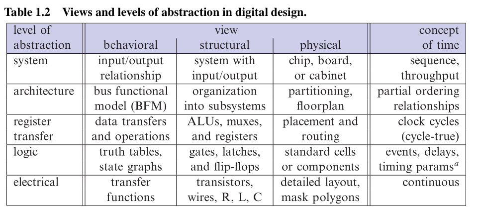

- **Observation 1.2.** Redesigns are so devastating for the business that the entire semiconductor industry has committed itself to “first-time-right” design as a guiding principle. To avoid them, VLSI engineers typically spend much more time verifying a circuit than actually designing it.

## Glossary of logic families
- NMOS vs CMOS: 
    - NMOS: static power ( vcc --[ R ]-- uC ) :> I2xR 
    - COMS: connects the vcc directly to the uC pin ( vcc --- uC )

- ECL vs CMOS: ECL is more expensive and does not have any true advantage to CMOS.

- MOS: metal oxide semiconductor
- FET: field effect transistor
- CMOS: Complementary MOS (circuit style or fabrication technology) where pairs of n- and p-channel MOSFETs cooperate in each logic gate; features zero quiescent power dissipation, or almost so; supply voltages have evolved from up to 15 V down to below 1 V.
- TTL: Transistor Transistor Logic, made up of BJTs and passive devices; first logic family to gain widespread acceptance as SSI/MSI parts, has evolved over many generations all of which share a 5 V supply.
- Originally a low-power but slow alternative to TTL, CMOS has become the technology that almost totally dominates VLSI today.
- This is essentially because layout density, operating speed, energy efficiency, and manufacturing costs per function benefit from the geometric down-scaling that comes with every process generation. 
- In addition, the simplicity and comparatively low power dissipation of CMOS circuits have allowed for integration densities not possible on the basis of BJTs.

## Definitions
- Schematic data include information that indicate where and how to draw icons, wires, busses, etc. on a computer screen or on a piece of paper
- Datapath is a generic term for all those subcircuits that
manipulate payload data
-  The controller does so by interpreting various status signals and by piloting datapath operation via control signals in response. A controller is either implemented as a hardwired finite state machine (FSM), as a stored program (program counter plus microcoded instruction sequence), or as a combination of both. 

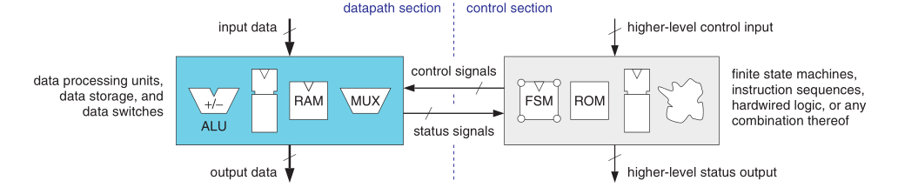

# Chapter 02: Field Programmable Logic
-  pre-manufactured subcircuits get configured into the target circuit via electrically programmable links that can be done — and in many cases also undone — as dictated by so called configuration bits. 

## Configuration technologies
- Static memory :
    - The key element here is an electronic switch — such as a transmission gate, a pass transistor, or a three-state buffer — that gets turned “on” or “off” under control of a configuration bit.
    - Unlimited reprogrammability is obtained from storing the configuration data in static memory (SRAM) cells
    - FPL device must (re-)obtain the entire configuration — the settings of all its programmable links — from outside whenever it is being powered up. The problem is solved in one of three possible ways, namely (a) by reading from a dedicated bit-serial or bit-parallel off-chip ROM, (b) by downloading a bit stream from a host computer, or (c) by long-term battery backup.

- Flash memory: 
    - Flash memories rely on special MOSFETs where a second gate electrode is sandwiched between the transistor’s bulk material underneath and a control gate above
    - Flash FPL devices are non-volatile and immediately live at power up, thereby doing away with the need for any kind of configuration-backup apparatus.  Data retention times vary between 10 and 40 years. Endurance of flash FPL is typically specified with 100 to 1000 configure-erase cycles, which is much less than for flash memory chips.

- Antifuse:
    - programming is permanent.
    - antifuses are only about the size of a contact or via and, therefore, allow for higher densities than reprogrammable links
    - Antifuse-based FPL is also less sensitive to radiation effects, offers superior protection against unauthorized cloning, and does not need to be configured following power-up.

## Organization of HW resources
- SPLD: simple programmable logic devices
- CPLD: Complex programmable logic devices
- PAL: programmable array logic 
image here cpld

- FPGA: field programmable gate array
    - Many configurable logic cells are arranged in a two-dimensional array with bundles of parallel wires in between. 
    - Fine-grained FPGAs: One speaks of a fine-grained architecture when the configurable cells are so simple that they are capable of implementing no more than a few logic gates and/or one bistable.
    - Coarse-grained FPGAs. Here cells are designed to implement combinational functions of four or more variables and are capable of storing two or more bits at a time.

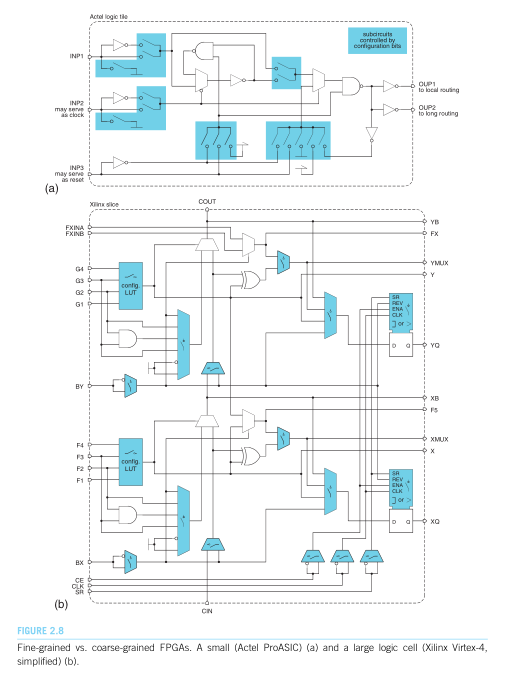

## Commercial Aspects

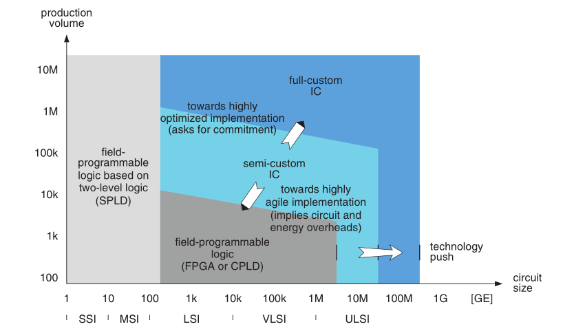

## Conclusions
- Field programmable logic is ideal for
    - Prototyping and other
    - Situations where agility is crucial because specifications are subject to change at any time,
    - Products that sell in modest quantities or where time to market is paramount, and for
    - Products that need to be reconfigured from remote.

# Chapter 04
- Hardware description languages (HDL) and design automation come to the rescue in four ways:
    - Exonerate designers from low-level details by moving design entry to more abstract levels.
    - Allow designers to focus on functionality as automatic synthesis tools generate circuits.
    - Facilitate design reuse by capturing a circuit description in a parametrized technology- and platform-independent form (as opposed to schematic diagrams, for instance).
    - Making functional verification more efficient by supporting stimuli generation, automatic response checking, assertion-based verification, and related techniques.

-  In digital circuit theory, sequential logic is a type of logic circuit whose output depends not only on the present value of its input signals but on the sequence of past inputs, the input history. This is in contrast to combinational logic, whose output is a function of only the present input. That is, sequential logic has state (memory) while combinational logic does not. 

## key concepts and constructs of VHDL
- Circuit hierarchy and connectivity
    - Abstraction, modularity, and repetition further help to arrive at manageable circuit descriptions. Any HDL that wants itself useful must support these techniques.
    - The interface is specified in the entity declaration whereas the details of its implementation are captured in a language element called architecture body, or architecture for short

- Interacting concurrent processes
    - The **process** statement is best summed up as being concurrent outside and sequential inside.
            - Its capability to update two or more signals at a time,
            - The fact that the instructions for doing so are captured in a sequence of statements that are going to be executed one after the other,
            - The liberty to make use of variables for temporary storage, plus
            - A more detailed control over the conditions for activating the process.
    - behavioral models specify how a design entity is to react in response to changing input
    - In VHDL, the behavior of a digital circuit typically gets described by a collection of concurrent processes that execute simultaneously, that communicate via signals, and where each such process represents some subfunction.
    - A procedural model essentially describes functionality in a sequence of steps much as a piece of conventional software code. A circuit is captured in one process statement and its behavior gets implemented with the aid of sequential statements there.
    - A dataflow model describes the behavior as a collection of concurrent signal assignments that get executed under the coordination of the signals exchanged.
    - A structural model describes the composition of a circuit by way of component instantiation statements along with the interconnections in between. It is equivalent to a netlist.

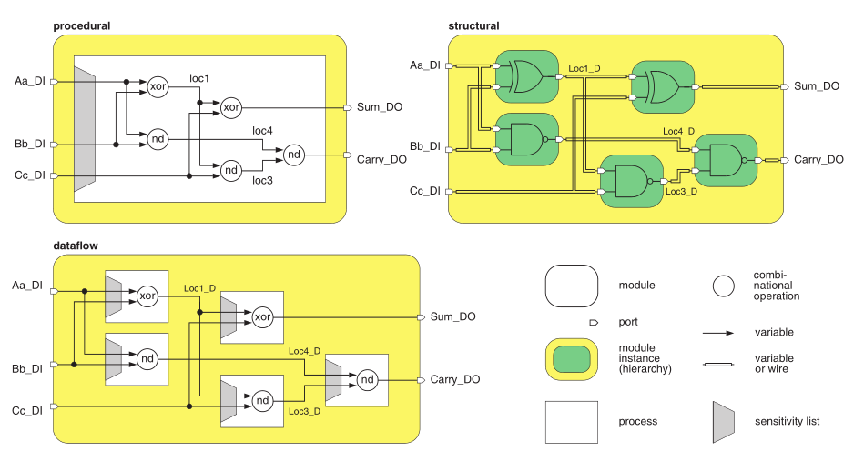

- A discrete replacement for electrical signals
    - Distinguishing between logic 0 and 1 is inadequate for modeling the binary signals found in digital circuits. A more elaborate multi-valued logic system must be sought that is capable of capturing the effects of both node voltage and source impedance 
    - Node voltage is quantized into three logic states:
            - low: logic low, that is below Ul.
            - high: logic high, that is above Uh.
            - unknown: may be either “low”, “high”, or anywhere in the forbidden interval in between, e.g. as a result from a short between two conflicting drivers.
    - The amount of current that a subcircuit can sink or source  gets mapped onto three discrete drive strengths:
            - strong: the low impedance value commonly exhibited by a driving output.
            - high-impedance: the almost infinite impedance exhibited by a disabled three-state output.
            - weak: an impedance somewhere between “strong” and “high-impedance”
    - Two extra values have been added, namely:
            - uninitialized: has never been assigned any value, e.g. the internal state of a storage element immediately after power-up, distinguished from “unknown" as the latter can arise from causes other than failed initialization (applicable to simulation only).
            - don’t care: whether the node is “low” or “high” is considered immaterial, used by designers to leave the choice to the logic optimization tool (applicable to synthesis only).

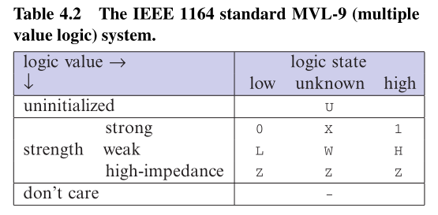

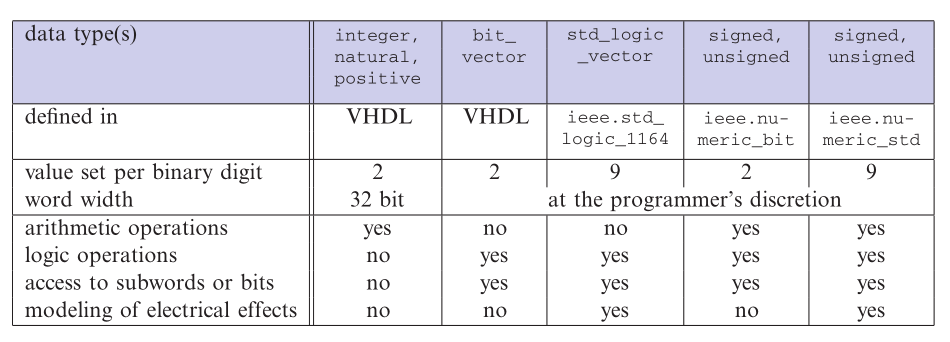

- An event-driven scheme of execution
    - In VHDL simulation, the continuum of time gets subdivided by events each of which occurs at a precise moment of simulation time. An event is said to happen whenever the value of a signal changes.
    - A **variable** has no time dimension attached which is to say that it merely holds a present value. The effect of a variable assignment is thus felt immediately. 
    - A signal, in contrast, is a typical element of VHDL. It is defined over time, which implies that a
    - A signal not only holds a present value, but also past values, plus those values that are anticipated to become manifest in the future. The effect of a signal assignment is not felt before the delay specified in the after clause has expired.

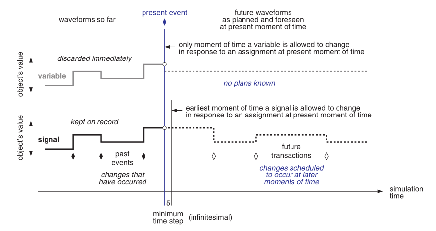
    
    - VHDL signals convey time-varying information between processes via the event queue. They are instrumental in process invocation which is directed by the same mechanism.  Variables, in contrast, are confined to within a process statement or a subprogram and do not interact with the event queue in any way.
    - A signal assignment does not become effective before the delay specified in the after clause has expired. In the absence of an explicit indication, there is a delay of one simulation cycle, so the effect can never be felt in the next statement. This sharply contrasts with a variable assignment the effect of which is felt immediately.
    -  As opposed to software languages where execution strictly follows the order of statements in the source code, there is no fixed ordering for carrying out processes (including concurrent signal assignments and assertion statements) in VHDL. When to invoke a process gets determined solely by events on the signals that run back and forth between processes.
    - Each process has its own set of signals that cause it to get (re-)activated whenever an event occurs on one or more of them. The entirety of such signals are aptly qualified as its wake-up or trigger signals although this is not official VHDL terminology.
    - Process statements that include multiple waits are not amenable to synthesis. Only process statements with a single wait or with a sensitivity list are.
    - The initial value given to a signal or variable defines the objects’s state at `t = 0`, just before the simulator enters the first cycle. A hardware reset, in contrast, remains ready to reconduct the circuit into a predetermined start state at any time `t ≥ 0`. This asks for distributing a dedicated signal to the bistables, both in the circuit and in its HDL model.

- Facilities for model parametrization
    - Generics: As stated earlier, signals carry dynamic, i.e. time-varying, information between processes and indirectly also between design entities. Generics, in contrast, serve to disseminate static, i.e. time- invariant, details to design entities.

```vhdl
component parityoddw -- w-input odd parity gate
    generic (
        WIDTH : natural range 2 to 32; -- number of inputs with supported range
        TCD : time := 0 ns, -- contamination delay with default value
        TPD : time := 1.0 ns ); -- propagation delay with default value
    port (
        Inp_DI : in std_logic_vector(WIDTH-1 downto 0);
        Oup_DO : out std_logic );
end component;

-- other file
constant NUMBITS : natural = 12;

-- component instantiation statement
    u173: parityoddw
                generic map ( WIDTH => NUMBITS, TCD => 0.05 ns, TPD => (NUMBITS * 0.1 ns) )
                port map ( Inp_DI => DataVec_D , Oup_DO => Parbit_D );
.....
```

    - up to four HDL models may occur during a VLSI design cycle to capture a circuit-to-be at distinct levels of detail. Designers also experiment with alternative circuit architectures to compare them in terms of gate count, longest path delay, energy efficiency, and other figures of merit. VHDL accommodates all this need by allowing a design entity to have more than one architecture body.

```vhdl
.....
for u113: binary2gray use entity binary2gray(behavioral);
for u188: binary2gray use entity binary2gray(structural);
for all: xnor2_gate use entity GTECH_XNOR2(behavioral);
```

- Concepts borrowed from programming languages

```vhdl
constant FERMAT_PRIME_4 : integer := 65537;
variable Brd : real := 2.48678E5;
-- enum
type month is (JANUARY, FEBRUARY, ... , DECEMBER);
-- type declaration
type audiosample is signed(23 downto 0);

-- report (struct)
type date is record
    date_year : integer;
    date_month : month;
    date_day : day;
end record;
```

    - A subtype shares the operations with its parent type, but differs in that it takes on a subset of data values only.

```vhdl
subtype day is integer range 1 to 31;
```
    - VHDL supports information hiding and incremental compilation.

## Automatic circuit synthesis from hdl models
- Automatic synthesis aims at turning some sort of behavioral description into a gate-level netlist with as little human intervention as possible.
- State reduction eliminates redundant states, if any, while state encoding assigns a unique binary code to each state.
- The subsequent synthesis step builds all necessary state registers and specifies the combinational subfunctions in between. 
- The result is a preliminary network described at an intermediate level of detail, that is in terms of logic equations and generic components rather than actual logic gates.
- Boolean optimization reworks the logic networks in an attempt to bring their longest signal propagation paths below the relevant user-defined timing constraint while, at the same time, minimizing hardware complexity. 

- Finite state machines and sequential subcircuits in general
    -  Any process that is supposed to model a piece of hardware must execute upon activation, return to the same instruction, and suspend there.
    - The reason is that each `wait` or similar statement that may cause a process to suspend is allowed to carry its own wake-up condition. Depending on the details postulated there, the source code may imply synchronous or asynchronous behavior. 

- Distributing an FSM over two (or more) concurrent processes
    - Capturing sequential and combinational behavior in separate processes is universally accepted and tends to lead to more economic circuit structures during synthesis. As an additional benefit, the type of automaton (Mealy, Moore, Medvedev) can be changed at any time without having to reorganize the source code too much.
    - In conclusion, the rules below ensure trouble-free synthesis and portability across platforms

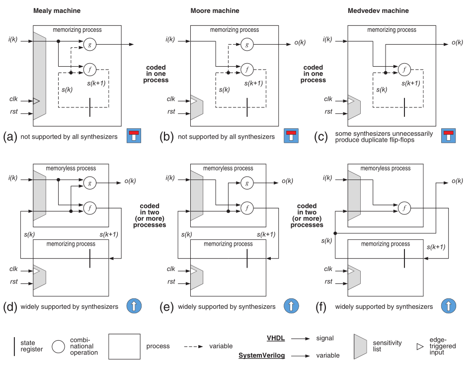

- RAM and ROM Macrocells
    - next figure  shows how a synthesis model must be organized in order to obtain various read-only and read-write storage functions 

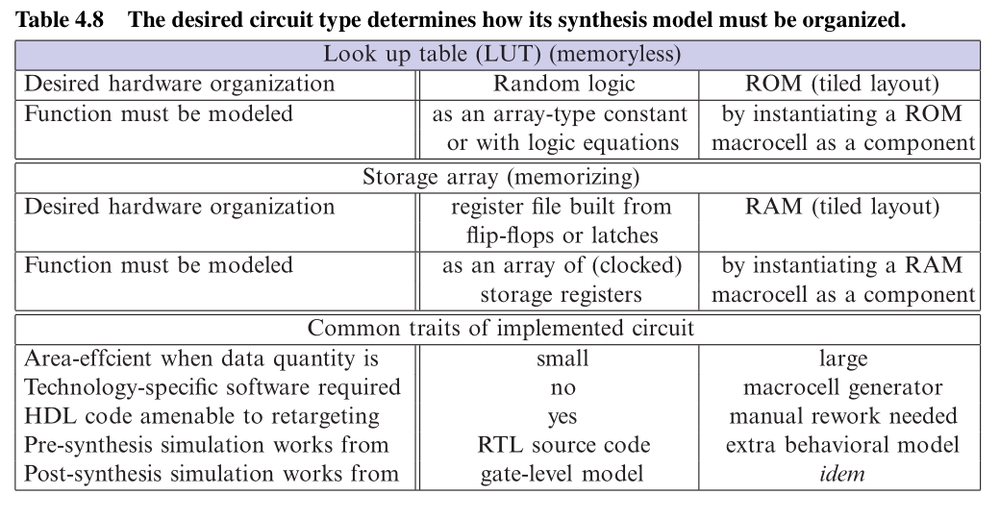


- Timing constrains
    - A timing constraint is a user-defined target for some timing quantity that the final circuit must meet.

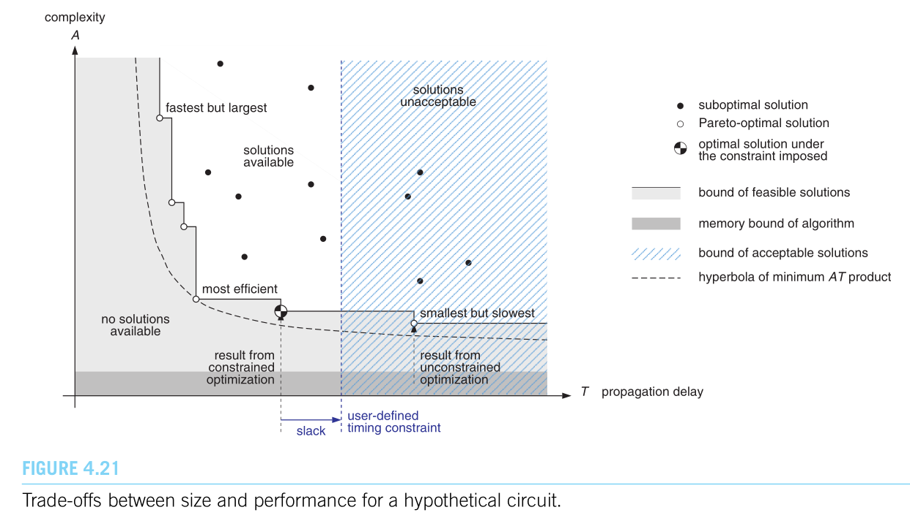

    - Timing-related HDL constructs are for simulation purposes exclusively and get ignored during synthesis. They serve to model the behavior of existing circuits, not to impose target
    - As a workaround, timing and other synthesis directives must be expressed with the aid of proprietary language extensions or with scripting languages such as Tcl

- How to partition a circuit in view of synthesis and optimization:
    - The better the initial architecture and the various design entities (VHDL) aJnd modules (SysVer) in the RTL source code reflect a sensible hardware organization, the less effort will have to be wasted in repartitioning at synthesis time.
    - Hint: Synthesis and optimization work much better if a design is organized such that
        - related or tightly connected subcircuits belong to the same design entity,
        - all outputs from a synthesis chunk are registered, and
        - critical paths are confined to within one synthesis chunk.
